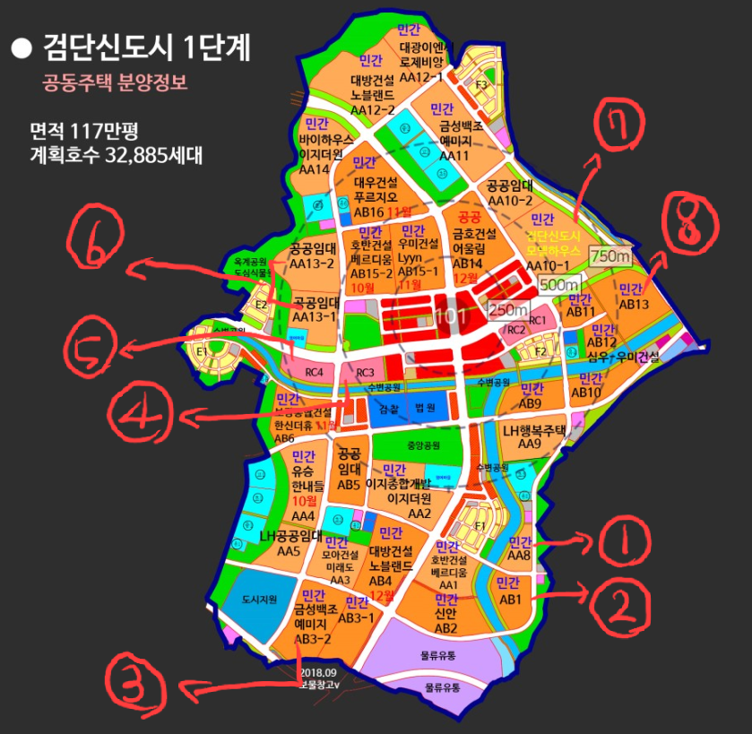

21년 3월 9일 기준 검단신도시 1단계 남은 블록 예상분양일정 정리해보았습니다. 수정사항이 있을 경우 지속적으로 업데이트할 예정이니 피드백 부탁드려요!  
  

1\. AA8 우미린 약400세대 21.3.18 모집공고예정

2\. AB10 우미린 약850세대 21.3.18 모집공고예정

3\. AB3-2 예미지 약1200세대 4월 모집공고예정

4\. RC3 금강 약400세대 4월 모집공고예정

5\. RC4 금강 약400세대 6월 모집공고예정  

6\. AA13-1, AA13-2 자이 약 1700세대 상반기 모집공고예정

7\. AA10-1 약1400세대 예상일정미정

8\. AB13 호반 예상일정미정

<figure>

<figcaption>

이미지출처 :  sweetanalyst.com

</figcaption>

</figure>
