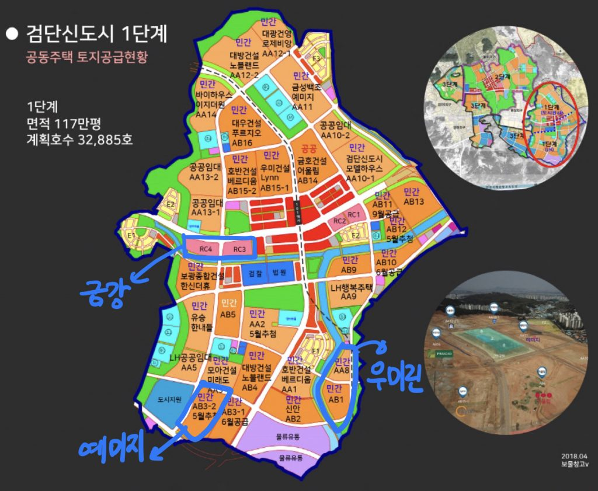
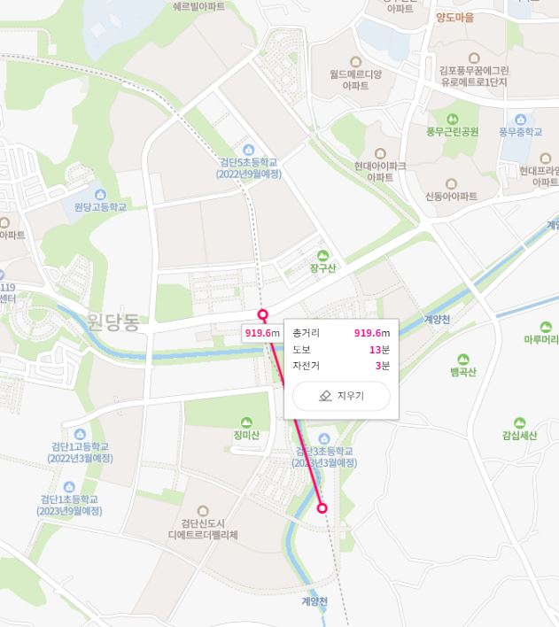
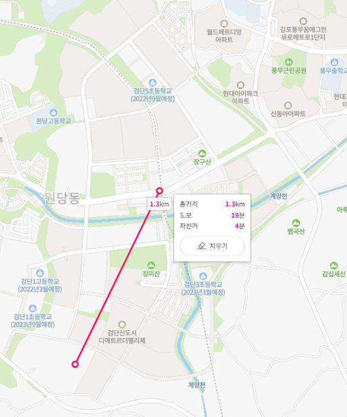
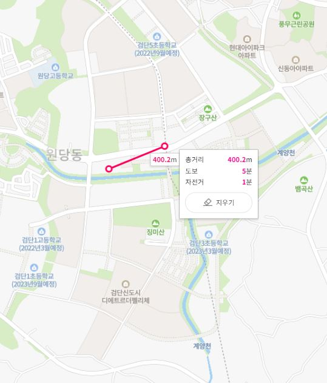
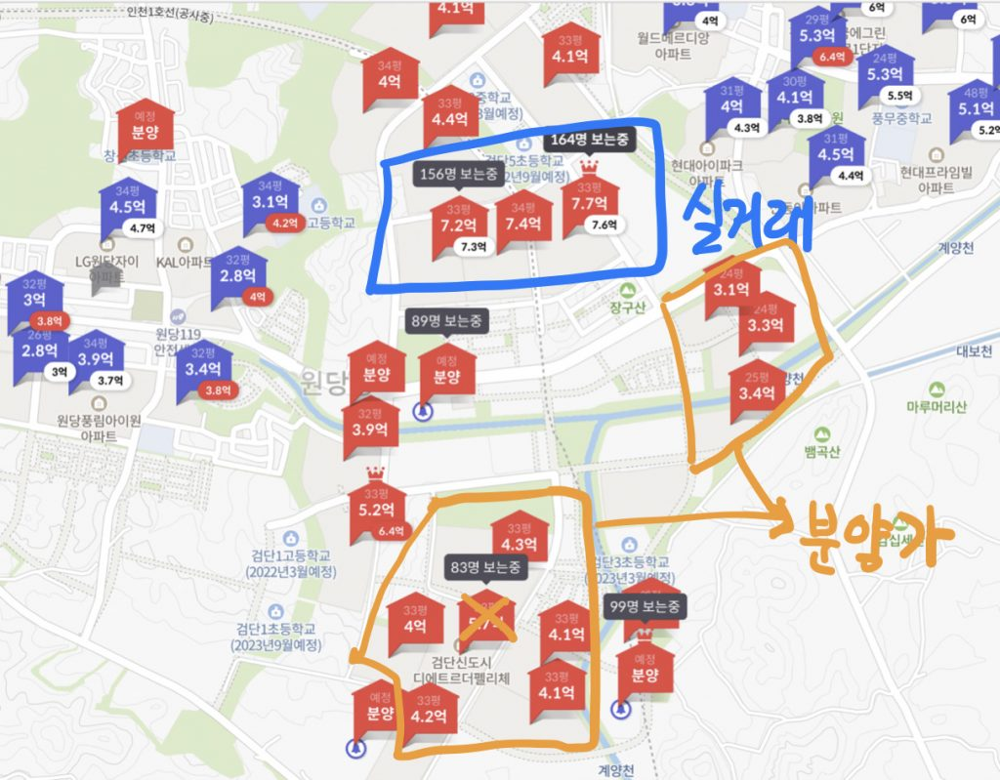

## 개요

안녕하세요 데일리리뮤입니다.

오늘은 검단신도시 1단계의 3월, 4월 분양예정단지의 평형별 예상분양가를 알아보겠습니다.

검단신도시 분양예정단지는 크게 3가지로 볼 수 있는데요

1. (AA8, AB1) 검단 우미린 파크뷰 1단지, 2단지(3/18, 분양공고 예정) (3월말 연기)
2. (AB3-2) 검단 예미지(4월 분양예정)
3. (RC3, RC4) 검단 금강펜테리움(각 4월, 6월 분양예정)

<figure>

<figcaption>

이미지출처 : 보물창고v

</figcaption>

</figure>

## 단지별 분양세대 및 특징

1. 검단 우미린 파크뷰 1단지는 370세대(59A 165세대, 59B 92세대, 84 113세대)  
    우미린 파크뷰 2단지는 810세대(59A 375세대, 59B 170세대, 84 265세대입니다.  
      
    역에서 거리는 조금 먼 800m~1km로 도보 10~15분 거리입니다.  
    바로 파크뷰 1단지 옆 초등학교가 있고 1단지, 2단지 모두 수변뷰입니다.(현재는 계양천이 깨끗하지 않으나, 신도시 입주 이후 개선 작업이 예상됩니다.)  
    

<figure>

<figcaption>

이미지출처 : 네이버지도

</figcaption>

</figure>

2\. 검단 예미지 1229세대는 60~85 856세대, 85초과(추첨가능) 373세대로 대단지입니다.

대단지의 장점이 있으나, 비슷한 시기에 분양하는 우미린 파크뷰에 비해 역이 더 멀고(도보 15~20분 예상) 초등학교가 조금 더 멀리 있습니다.

3\. 검단 금강펜테리움은 RC3, RC4블럭은 각 483세대, 447세대입니다. (모두 84타입 예정입니다.)

이 두 단지는 101역 (300~500m, 도보5분이내) 및 중심상업지구와 근접 주상복합으로 1층~2층 상업시설이 들어올 것으로 예상됩니다.

<figure>

<figcaption>

출처 : 네이버지도

</figcaption>

</figure>

## 예상분양가 및 기대차익

1. 검단 우미린 파크뷰 1단지, 2단지 : 84타입 기준 4억 초중반, 59타입 3억중반
2. 검단 예미지 2차 : 84타입 4억 초중반
3. 검단 금강펜테리움 : 84타입 5억 초중반

아래 사진은 호갱노노 실거래가 및 분양가입니다.  
파란 네모는 18년말~19년초 분양한 단지의 실거래가 (7억대)이며, 주황 네모는 아직 실거래가 없는 단지들의 분양가입니다.  
\* X표시한 단지는 탑층 기준 가격으로 제외하였습니다.

주변단지 분양가를 참고하여 볼때 위에 1~3 분양가를 예상하여 볼 수 있습니다.  
(예상 분양가이며, 실제 분양가와 차이가 있을 수 있음을 인지해주세요!)

<figure>

<figcaption>

출처: 호갱노노

</figcaption>

</figure>

아래 부동산 질문게시판에 부동산 질문 남겨주시면 사소한 것도 최대한 답변드리겠습니다. [부동산 질문게시판](https://www.dailyremu.com/?page_id=461&mod=list)
