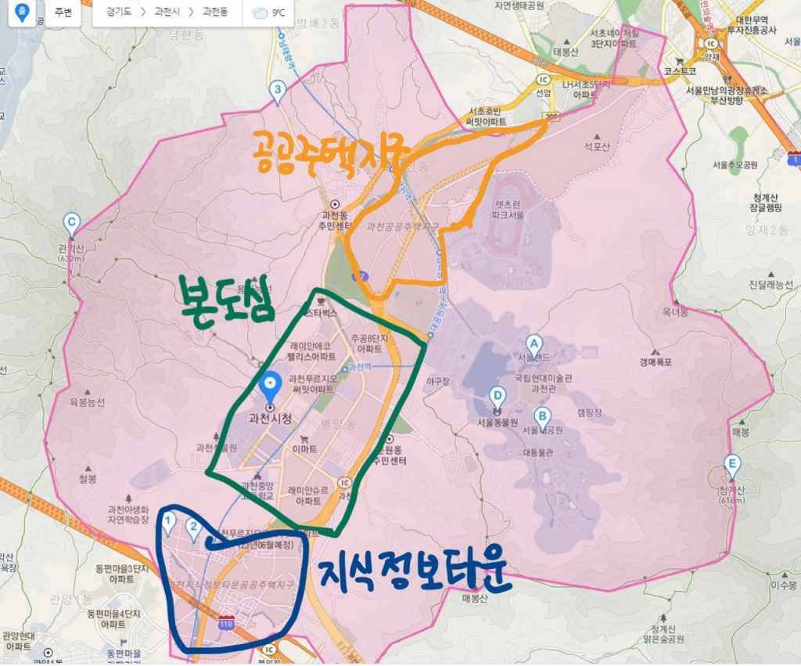
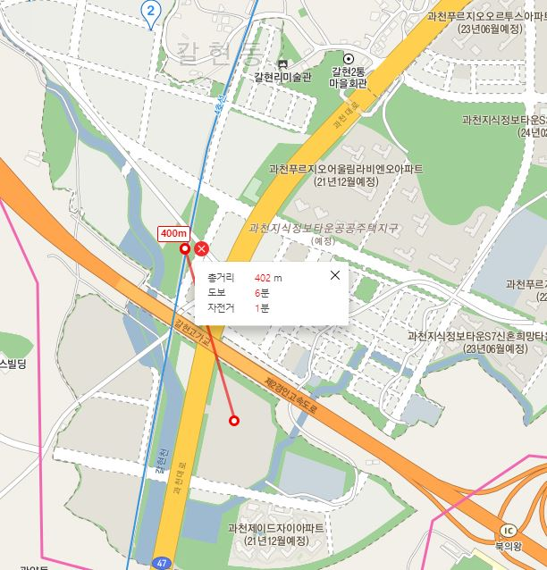
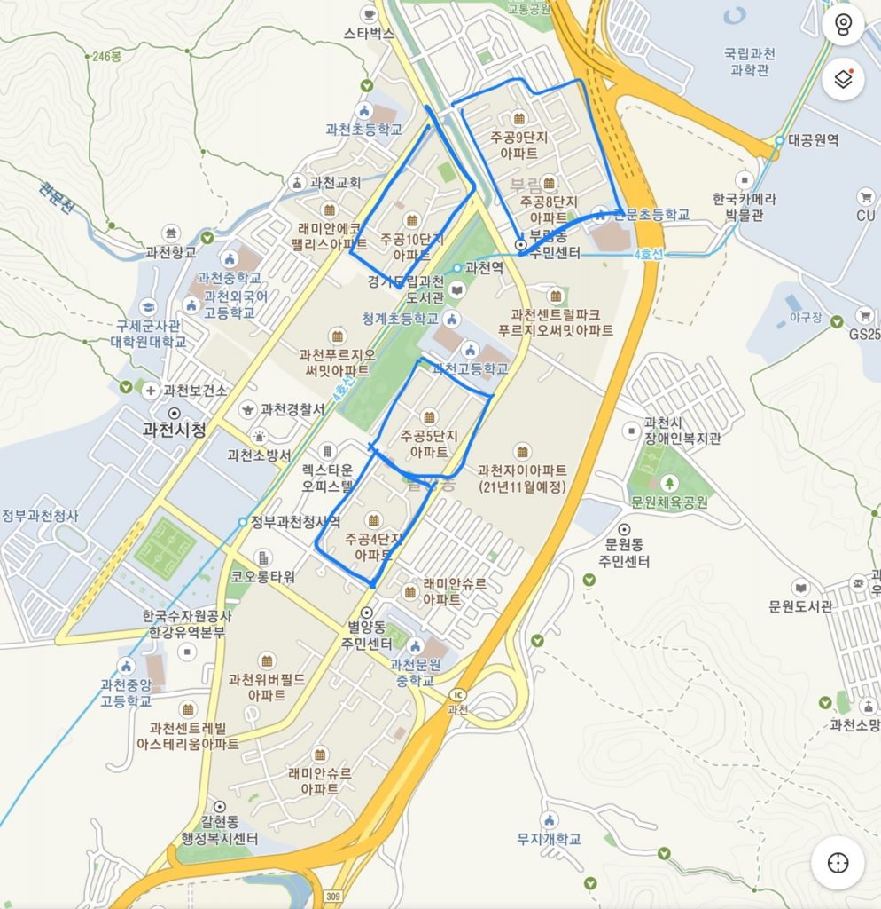
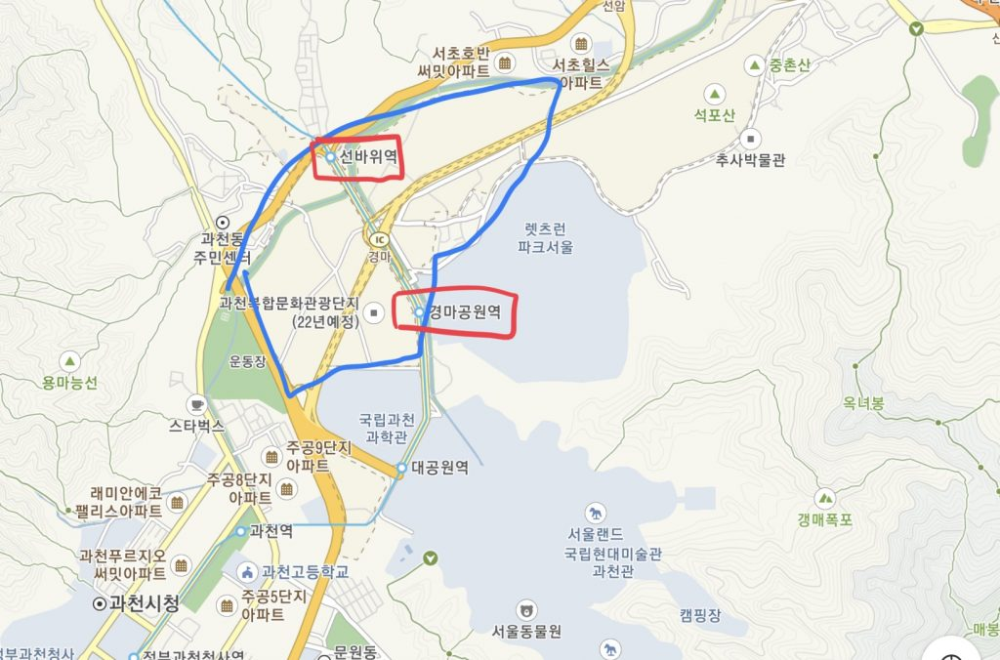

안녕하세요 데일리리뮤입니다.

오늘은 경기도 과천시 전반의 분양물량에 대해 정리해보도록 하겠습니다.

과천은 크게 세가지 구역으로 나눠 볼 수 있습니다.(향후 분양예정 순서대로 아래 순서를 작성하였습니다.)

1. 과천 지식정보타운
2. 과천 본도심
3. 과천 신도시(공공주택지구)

<figure>

<figcaption>

이미지출처 : 카카오맵

</figcaption>

</figure>

## 1\. 과천지식정보타운

이중 과천 지식정보타운은 2020년 핫하게 분양되었으며, 이제는 S2블록, S8블록의 분양물량이 남아있습니다.

- (시기미정) S2블록은 아직 미정으로 중소형평수로 800세대 가량 예정되있습니다.  
    
- (상반기 예정) S8블록은 신동아, 우미 컨소시엄에서 총 659세대를 상반기 분양할 예정입니다.  
      
    S8블록 분양예정물량은  
    공공분양 318세대(60타입 이상),  
    신혼희망타운 227세대(60타입 이하),  
    행복주택 114세대(60타입 이하)입니다.

이중 S8블록의 입지는 작년 성공적으로 분양했던 S4, S5블록과 비교해볼만합니다.

새로 개통될 지식정보타운역과 400m~600m거리로 도보 5분정도 거리에 있고 바로 옆(동쪽)에 초, 중 통합학교가 신설예정에 있습니다.

<figure>

<figcaption>

이미지출처 : 카카오맵

</figcaption>

</figure>

공공분양, 신혼희망타운, 행복주택 청약자격이 되시는 분은 꼭 청약해보시길 바랍니다.

## 2\. 과천 본도심

과천의 대장들이 모여있는 본도심은 현재 2기 재건축 단지가 마무리 단계를 향해 가고 있습니다. (과천위버필드 2단지 입주완료 , 7-1단지 푸르지오써밋 입주완료, 6단지 과천자이 22년 초 입주 예정)

이제 관심은 3기 재건축단지(4단지, 5단지, 8,9통합, 10단지)들로 향하고 있는데요.

<figure>

<figcaption>

이미지 출처 : 카카오맵

</figcaption>

</figure>

이 중 가장 진척도가 빠른 단지는 주공4단지입니다.

주공4단지는 GS건설이 시공을 담당하며 약 1400세대가 들어설 예정입니다.  
타입별 세대수는 49타입 56세대, 59타입 203세대, 74타입 346세대, 84타입 672세대, 99타입 95세대, 106타입 30세대, 118타입 32세대, 110타입 1세대, 126타입 2세대 입니다.

현재 1100여 세대가 거주중이므로 약 300 세대 일반분양이 있을 것으로 예상해볼 수 있습니다.

주공4단지는 단지 앞 바로 이마트가 있고 향후 개통될 GTX-C 과천역(정부과천청사역 인근)과 가까워 입지가 매우 훌륭한 단지입니다.

이 후 진척도가 빠른 단지는 5단지와 8,9 통합 재건축단지입니다.

5단지는 20년 1월 조합설립인가를 받고 재건축을 추진중입니다. 현재 800세대이며 약 1300세대로 건축할 계획을 갖고 있다고 합니다.

8,9통합 단지는 현재 2100세대이며 ,2021년 2월 조합설립인가를 승인받고 약 2800세대로 재건축을 추진하고 있습니다.

아래에 첨부한 2015년(조금은 지났지만) 재건축 분석 기사를 참고하여 볼때 조합설립인가에서 준공까지 평균 약 8년의 시간이 걸렸다고 하네요  
그렇지만 유능한 조합이 신속하게 재건축을 진행하였으면 하는 바램입니다.

> <중앙일보>  
> 출처 : https://news.joins.com/article/18486349  
> 조합설립에서 사업시행인가 통과까지 2.2년 △관리처분인가 1.5년 △착공 1.2년 △준공 2.8년   

10단지는 3월중 창립총회를 통해 조합설립인가를 추진한다는 계획이 예정되어있습니다.

이에 더해 우정병원 부지에 신규 분양 물량이 있습니다.  
LH가 기존 우정병원 부지에 174세대(84타입 86세대, 59타입 88세대)를 분양할 계획을 가지고 있습니다. 21년 2월 분양가심의 서류를 과천시에 접수했다고 하여 분양이 얼마남지 않은 것으로 보입니다. 21년 상반기중 분양을 예상하나, 우정병원 부지 분양이 과거 몇 년동안 지연되어온 사례를 볼 때 또 다른 변수로 지연되지 않을까 우려됩니다.

## 3\. 과천 신도시 공공주택지구

과천 신도시는 약 7000세대로 계획되어있으며, 경마공원역~선바위역을 감싸는 부지에 위치하고 있습니다. 양재와 매우 가까워 준강남이라고 불리는 입지입니다.

<figure>

<figcaption>

이미지 출처 : 카카오맵

</figcaption>

</figure>

21년 하반기 1700여세대가 사전청약이 예정되어있습니다.  
그러나..LH직원들의 투기 의혹이 점점 커지는 상황에 정상적인 추진이 가능할지 의문이 듭니다.

과천 신도시 옆 주암지구도 예정되어있는데요 주암지구는 향후 다뤄보도록 하겠습니다.

감사합니다!
