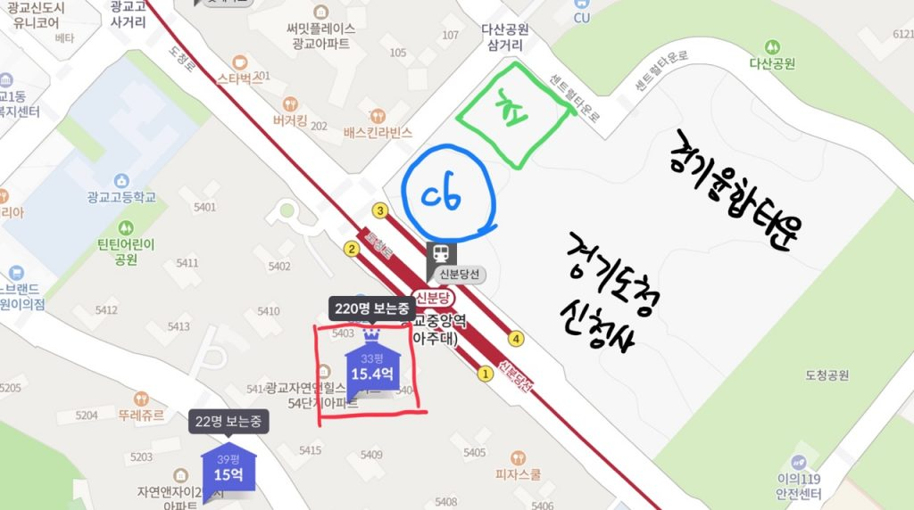
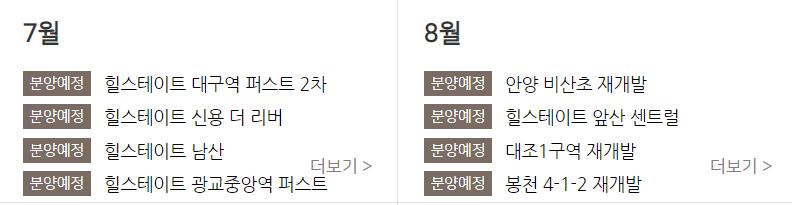

안녕하세요. 데일리리뮤입니다.

오늘은 이번 상반기 분양이 예상되는 힐스테이트 광교중앙역 퍼스트에 대해 알아보겠습니다.

설명에 앞서 그간 이 단지는 분양이 작년부터 연기되어 왔는데요.

### 분양연기이유

올해 2월 머니투데이 취재결과, 초등학교 근처 건축물에 대한 교육환경영향평가 때문이라고 합니다. 초등학교 근처 21층 이상의 건축물은 위 평가를 의무적으로 받아야 하는데요. C6는 건축설계 변경 전 21층으로 교육환경영향평가 대상에 해당되었습니다.

시행사가 해당 평가를 받지 않기 위해 건축설계를 20층으로 변경하여 허가를 기다리고 있다고 합니다.

건축 설계 변경 허가시, 분양가 심의를 거쳐 상반기 내 분양이 예상됩니다.

### 입지(교통, 초등학교, 일자리)

힐스테이트 광교중앙역 퍼스트의 입지는 2021년 상반기 분양 중 최강으로 판단됩니다.

1\. 강남(34분)과 직결되는 광교중앙역 3번출구가 코앞에 있어 네이버지도로 도보시간을 체크할 필요도 없습니다.

2\. 신설 초등학교가 해당 주상복합 건물 바로 뒷편에 자리하고 있습니다.

3\. 삼성전자 수원사업장이 인근에 위치하고, 강남, 판교와 신분당선으로 연결되어 일자리 접근성이 훌륭하고 일자리의 퀄리티 또한 우수합니다.(고연봉)

### 예상 분양가 및 주변시세

분양세대수는 총 216세대(60~84타입)이며, 예상 분양가는 84타입 기준 7.5억~8억으로 예상됩니다.

주변시세는 바로 맞은편 단지인 광교 자연앤힐스테이트 의 최근 거래로 84타입 22층 15.37억(2021.2.15), 1층 13.45억(2021.2.5)이었습니다.

\*(추가업데이트, 21.5.18 기준) 현재 힐스테이트 공식홈페이지 상 7월에 분양이 예정되어 있습니다. 청약홈에 공고문이 뜨기 전까지는 언제든 연기 가능하므로 참고만 하시기 바랍니다.

<figure>

<figcaption>

이미지출처 : 힐스테이트 공식홈페이지

</figcaption>

</figure>

오늘도 좋은 하루 되세요.

아래 부동산 질문게시판에 부동산 질문 남겨주시면 사소한 것도 최대한 답변드리겠습니다. [부동산 질문게시판](https://www.dailyremu.com/?page_id=461&mod=list)
