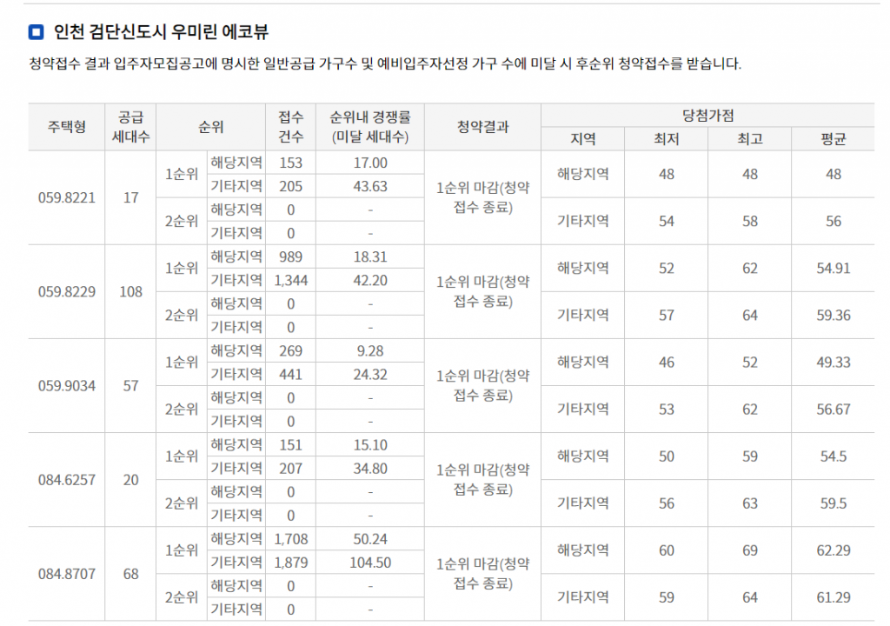
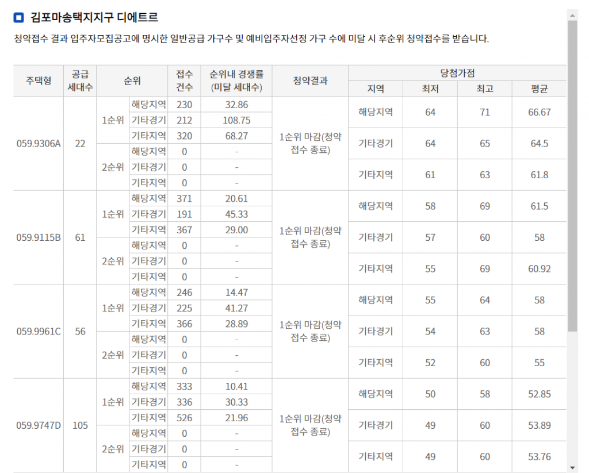
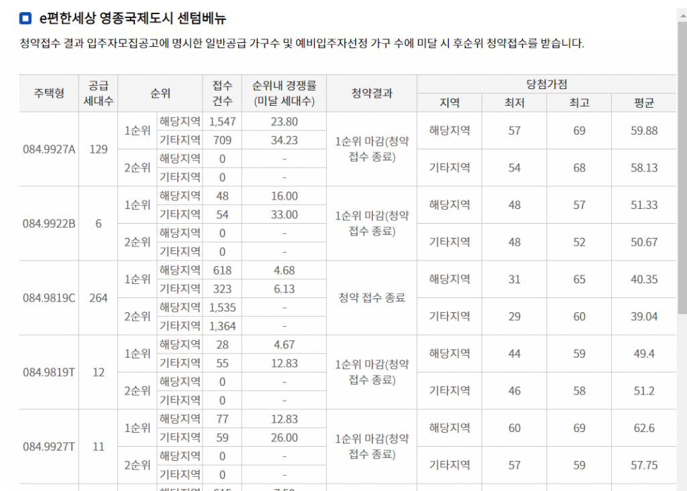

안녕하세요 데일리리뮤입니다.

오늘은 다음주 공고가 예정된 검단신도시 우미린 파크뷰 1,2단지 및 4월 예정된 금강 펜테리움의 일반분양 예상 당첨가능 점수를 알아보기 위해 과거 사례를 조사해보았습니다.

당첨 가점 예상에 대한 내용은 개인적인 의견이오니 참고수준으로 바라봐주시고, 이견이 있으시면 댓글로 달아주시면 참고하여 글을 개선해보겠습니다. 의견주시는분들 정말 감사합니다.

과거 분양한 두 단지(검단 우미린 에코뷰(20년3월), 김포 마송 디에르트(21년 2월), e편한세상 영종 센텀베뉴(21년 2월))의 점수 커트라인 및 앞으로 분양할 단지와의 차이를 비교하여 작성하였습니다.

검단 우미린에코뷰 단지는 검단신도시 직전 분양으로 검단 가점수준 참고용, 김포 마송 디에르트, e편한세상 영종 센텀베뉴 단지는 청약제도 변경이후 가점수준 참고용으로 작성했습니다.

### 1\. 검단 우미린 에코뷰(20년 3월 분양)

검단 우미린 에코뷰는 20년 3월 분양했습니다. 당시 84A, 의 최저 가점은 당해 50점, 기타 지역 60점이었으며, 84B타입의 최저가점은 당해 60점, 기타지역 59점이었습니다.

<figure>

<figcaption>

이미지출처 : 청약홈

</figcaption>

</figure>

#### 당첨가점 상승요소

당시 주변 단지인 금호어울림 센트럴 84타입은 4억초반이었습니다. 현재 84타입 호갱노노 기준의 1~2월 실거래가는 1월(6억240) 2월(7억 6824)입니다. 현재 기준 시세가 20년 3월 분양시기에 비해 많이 올라와 있습니다.

#### 당첨가점 하락요소

추가로 고려할 점은 청약제도의 변경입니다. 과거 우미린 에코뷰 분양당시와 달리 현재는 분양가상한제 적용으로 인한 전매제한 5~10년 및 실거주의무(전월세금지), 수도권 전역 LTV 40%적용 등 에 따라 당첨 가점 수준이 하락할 규제적 요소가 있습니다.

### 2\. 김포 마송 디에트르(21년 2월 분양)

최근 분양한 김포 마송 디에트르의 59타입(분양물량 모두 59타입이었습니다.)의 최저가점은 인기타입인 59A에서 당해 64점, 기타경기 64점, 기타지역 61점이었습니다. 비인기 타입(59C, 59D)에서 또한 당해 50점, 기타지역 49점으로 높은 편이었습니다.

그러나 이번 마송 디에트르는 분양물량의 가점제 40%, 추첨제 60%로 청약커트 점수가 높게 나올 요소가 있습니다.(가점제 분양물량이 적어 커트가 높게 나옴)

<figure>

<figcaption>

이미지 출처 : 청약홈

</figcaption>

</figure>

검단신도시와 지역도 다르고 상이한 가점제도로 직접비교는 어렵지만 서울과 거리가 조금 더 먼 김포 마송지구에서 또한 이렇게 높은 가점 수준이 나온 것을 참고하여볼 필요가 있습니다.

### 3\. 영종 e편한세상 센텀베뉴(21년 2월 분양)

21년 2월 분양한 영종 e편한세상 센텀베뉴는 영종 하늘도시에 초품아이면서, 적당한 중심상업지구와의 거리에 위치한 단지입니다.

해당 단지는 가점제 75%, 추첨제 25%로 당첨자를 선정하였으며, 최저당첨가점은 인기타입인 84A에서 당해(57점), 기타지역(54점)으로 수준을 보였습니다.

그러나 비인기타입이었던 84C는 당해(31점), 기타지역(29점)으로 상대적으로 낮은 가점 수준을 보였습니다.

서울 및 수도권의 인기단지는 면적타입별로 최저당첨가점 차이가 10점 이내로 크지 않으나, 최근 영종 센텀베뉴의 최저당첨가점차이는 20점후반대로 꽤 큰 차이를 보이고 있습니다.

비인기타입에 대한 전략적인 지원도 고려해보시면 좋을 것 같습니다.

### 예상가점수준 및 고려해볼만한 점

과거 분양 사례를 볼때 청약커트점수 상승요소, 하락요소 등이 공존하여 직접적인 비교가 어려워 저 또한 예상에 조심스럽습니다.

그럼에도 저는 이번 3~4월 분양에서 또한 이에 비해 높은 가점 수준을 보일 것으로 (조심스럽게)예상합니다.(많은 분들이 청약제도 변경으로 인해 청약커트 하락 의견을 주셨습니다.)

실거주의무강화 및 대출규제가 강화되었지만 검단신도시는 과거에도 실거주 중심의 청약이 많은 단지였고 분양가 또한 타 지역대비 낮은수준으로 이런 제도변경에 대한 하락요소에 비해 주변 시세상승으로 인한 청약경쟁률 상승이 더 클 것으로 생각합니다.

가점이 매우 높으신분은 원하는 청약 단지에 골라서 넣으셔도 좋겠지만 적어도 과거(검단 우미린 에코뷰) 당첨수준인 50점대 이하인 분들은 청약을 원하신다면 모든 단지에 청약을 넣으시고, 영종의 사례를 볼 때 비인기 타입에 대한 전략적인 청약도 가능해보이니 참고하시면 좋겠습니다.

모두 원하시는 단지의 제일 좋은 동호수에 당첨되시길 바랍니다. 감사합니다.
