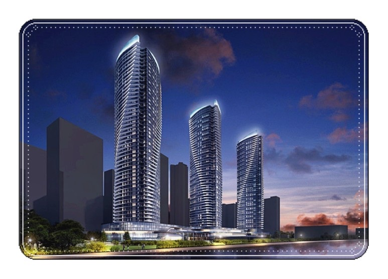
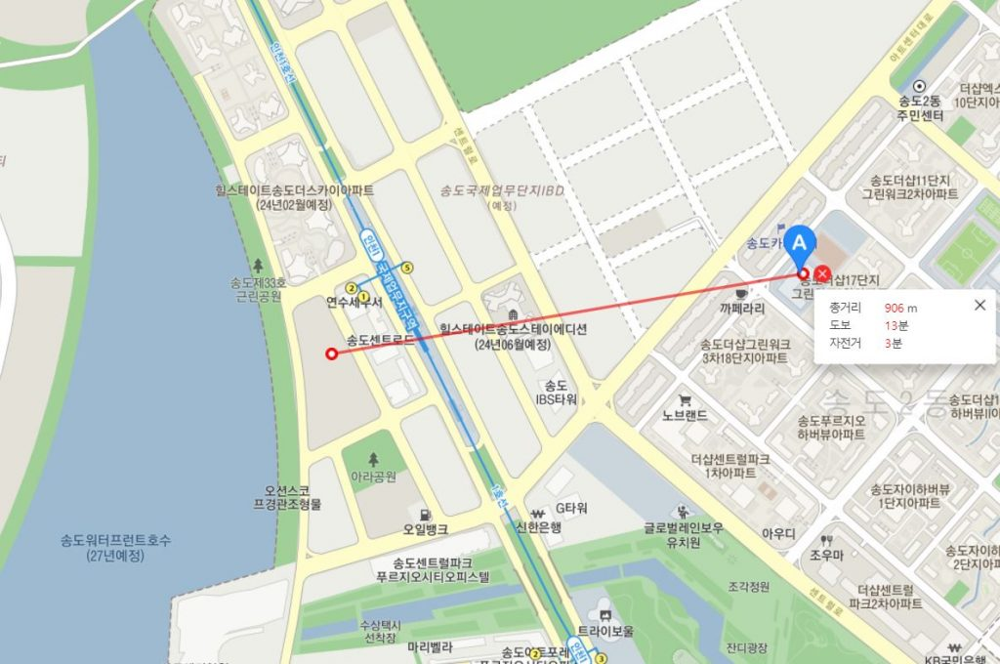
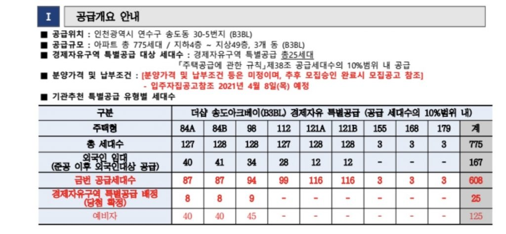
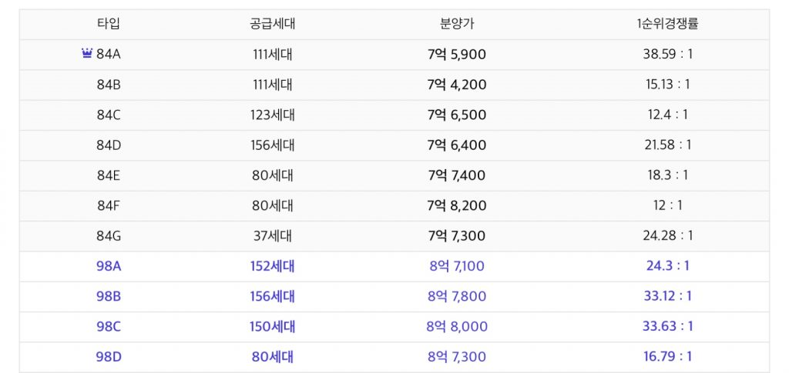

안녕하세요 데일리리뮤입니다.

오늘은 4월 8일 분양공고 예정인 송도 B3 포스코 아크베이의 입지 및 예상분양가를 알아보도록 하고 있습니다.(예상 분양가는 주변단지 및 특별공급 공고문을 기준으로 계산해보았습니다.)

많이들 보셨겠지만 송도 포스코 아크베이의 회오리 경관 사진은 정말 멋지네요. 저도 꼭 넣어보려고 합니다.

### 송도 포스코 아크베이 개요 및 입지

#### 개요

송도 포스코 아크베이는 84A타입 127세대, 84B세대 96세대, 98타입 128세대, 112타입 127세대, 121A타입 128세대, 121B타입 128세대, 155타입 3세대, 168타입 3세대, 179타입 3세대 분양예정입니다.

입주자 모집공고는 4.8(목), 사이버 견본주택 오픈은 4.9(금), 특별공급 청약 4.19(월), 당첨자 발표 4.27(화), 계약체결 5월10(월)~14(금)으로 예정되어있습니다.

#### 교통 및 상권 등

다들 아시는 얘기지만 간단히 짚고 넘어가겠습니다.

단지 바로 앞 국제업무지구역이 있으며, 향후(27년이후) 개통예정인 GTX-B 송도역과 한정거장(약 700m) 거리에 위치해 있습니다.

커넬워크, 코스트코, 롯데마트와도 1~2km로 근접한 위치에 있으며, 단지 앞 워터프론트 조망도 뛰어날 것으로 생각됩니다.

#### 초등학교

배정 예정인 초등학교는 소문으로는 연송초등학교라고 합니다. 초등학교까지의 직선거리는 약 900m로 도보로 이동할 경우 돌아 돌아 꽤 먼거리에 위치해 있습니다.

<figure>

<figcaption>

이미지 출처 : 카카오맵

</figcaption>

</figure>

### 예상분양가

예상 분양가는 21년 3월 5일, 인천경제자유구역 홈페이지에 게시된 "더샵 송도아크베이 경제자유구역 특별공급 안내문"과 최근 분양(21.1)한 송도 자이 크리스탈 단지의 분양가를 참고하여 계산하였습니다.

<figure>

<figcaption>

이미지 출처 : 인천경제자유구역 홈페이지

</figcaption>

</figure>

표에서 공급 물량을 보시면 98타입에 특별공급 물량이 있음을 아실 수 있습니다. 이는 곧 98타입의 가격이 9억 미만으로 나온다는 이야기입니다.

최근 21.1월 분양했던 송도 크리스탈 자이의 98A 타입의 분양가는 8.7억~8.8억 수준이었습니다.

송도크리스탈자이에 비해 송도 포스코아크베이의 분양가가 소폭 높을 것으로 보통 예상하시는데요.(일반적으로 시기가 지날수록 분양가가 높아짐)

이를 통해 포스코 아크베이의 98타입은 8.8~9억 미만으로 나올 것을 알 수 있습니다.

84타입의 분양가도 송도크리스탈 자이의 분양가 (98타입 대비 84타입) 비율로 대략 예상해보았는데요.

크리스탈 자이의 98타입 분양가는 최대 8.8억, 84타입은 최대 7.65억 이었네요. 이를 나눠보면 7.65/8.8억 = 87%라는 비율이 나옵니다.

포스코 아크베이 84타입의 예상 분양가는 8.8~9억에 87% 비율을 곱한 7.7억~7.85억입니다.

타 단지의 비율을 곱한 숫자로 84타입의 분양가는 이와 2~3천정도는 차이가 있을수 있다고 생각합니다ㅎㅎ  
그리고 기본분양가에 옵션질을 얼마나 할지도 나와봐야 아는 요소입니다.

다시 정리 해보면 예상 분양가는  
84타입 7.7~7.85억, 오차범위 2~3천만  
98타입 8.8~9억입니다.

이상으로 글을 마치며, 최근 분양한 송도자이 크리스탈오션은 계약포기로 청약통장을 날리는 분들이 속출하고 있다하니, 자격여부 및 자금조달계획에 대해 신중하고 꼼꼼하게 고려해보시고 청약하시길 바랍니다.

아래 부동산 질문게시판에 부동산 질문 남겨주시면 사소한 것도 최대한 답변드리겠습니다. [부동산 질문게시판](https://www.dailyremu.com/?page_id=461&mod=list)
