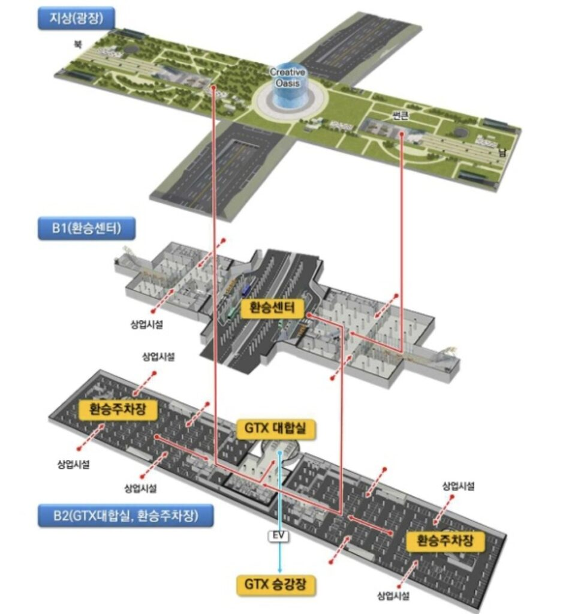
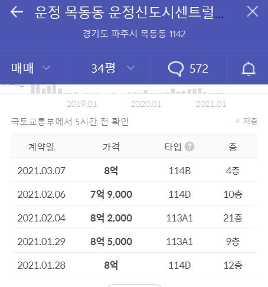
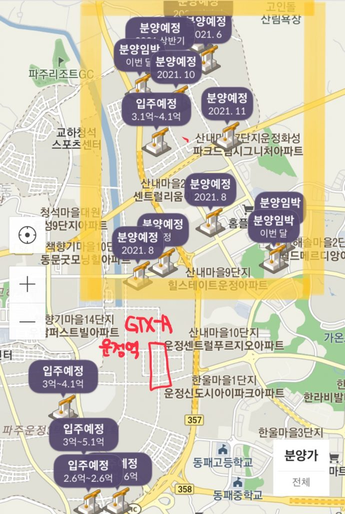
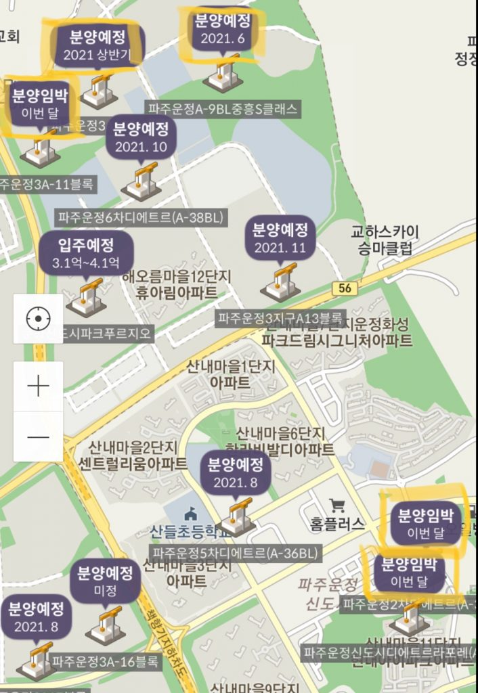

### GTX-A 운정역

안녕하세요 데일리 리뮤입니다. 오늘부터는 GTX-A 노선 인근의 분양물량 들에 대해 다뤄보고자 합니다. GTX-A 노선은 2024년 개통 예정으로 현재 예정된 GTX 노선 중 가장 진행속도가 빠릅니다.

소개하기에 앞서 GTX-A역에 대해 간단히 짚고 넘어가면, 노선이 운정-킨텍스-대곡-연신내-서울역-삼성-수서-용인-동탄 으로 예정되어 있으며, GTX를 타고 이동시 운정역에서 삼성역까지 30분 안에 도착할 것으로 예상됩니다.

### 운정역 환승센터

또한 이곳에는 복합환승센터 건설이 추진되고 있으며, 이 사업은 20년 국토교통부 GTX 환승센터 시범사업 우수사례에 선정되었습니다. 지상에는 광장, 지하 1층은 버스 환승센터 및 상업시설, 지하 2층은 주차장 및 GTX 노선이 계획되어있습니다.

<figure>

<figcaption>

이미지출처 : 경기신문

</figcaption>

</figure>

### 운정역 인근 시세 및 분양예정물량(21년 3월 19일 기준

이렇게 교통이 우수한 입지 덕분에 최근 GTX역과 인접한 운정 센트럴 푸르지오의 최근 실거래가는 21.3.7 기준 34평 8억, 21.2.6 기준 34평 7.9억으로 높은 수준입니다.

<figure>

<figcaption>

이미지출처 : 호갱노노

</figcaption>

</figure>

위 단지만큼 우수한 입지는 아니지만 운정신도시에는 많은 분양물량이 예정되어있는데요.

아래 지도에서 GTX-A 운정역 예상 위치와 파주 운정신도시의 분양예정단지 위치를 알 수 있습니다. 형광펜 표시한 단지들이 향후 분양예정 단지들인데요. 이 단지들은 GTX 운정역과 직선거리로 2~3km 거리이며, 걷기에는 멀지만 버스를 타고 이동하면 10~15분 내외로 역에 도착할 것으로 예상됩니다.

<figure>

<figcaption>

이미지출처 : 직방

</figcaption>

</figure>

이 중 분양이 얼마 남지 않은 단지들이 많이 있는데요. 그중 3월, 6월 및 상반기내 분양 예정물량을 간단히 말씀드리겠습니다.

#### 3월 예정

##### 운정 디에르트 2차/3차, 3.26 공고예정

아래 지도상 우측하단의 "분양임박"이라고 표시된 단지는 디에트르 2차, 3차단지로 각각 512세대(84타입 360세대, 110타입 152세대), 297세대(84타입 207세대, 110타입 90세대)이며 3/26 분양 공고 예정일이 딱 일주일 남아 있습니다. (청약일자는 4/5 특별공급 대상 청약 예정)

운정 디에트르 2,3차의 입지분석, 분양가예상 등 더 자세한 내용은 다음 글에서 다뤄보겠습니다.

##### 중흥 S클래스(3A-11블록), 미정?

아래 지도의 좌측 상단에 이번달 분양을 앞둔 단지를 하나 더 확인하실 수 있는데요.

해당 단지(3A-11)는 중흥건설이 시공을 맡을 예정이며 750세대가 이번달 분양 계획 중으로 나와있으나, 아직까지 중흥건설 홈페이지에도 구체적인 소식이 없어 지연된 것이 아닌가 합니다. 추가 정보가 있으면 업데이트 하도록 하겠습니다.

#### 6월 및 상반기 예정

3월 이후 6월 혹은 상반기 이내 분양 예정인 단지는 두단지가 위의 지도 상단에 위치해있습니다. 두단지 모두 지도상으로는 GTX역과 멀게 보일 수 있지만, 네이버 지도 직선거리상으로는 약 3km정도로 멀지 않습니다.

위 지도의 가운데 상단에 위치한 21.6 분양예정단지(A-9BL)는 중흥건설(중흥S클래스)이 450세대를 공급할 계획을 가지고 있으며,

지도의 좌측상단에 위치한 21년 상반기 분양예정단지(3A7BL)는 제일건설(제일풍경채)이 466세대를 공급할 계획을 가지고 있습니다.

이번 글에서는 운정신도시 주요아파트의 최근 실거래가 및 21년 상반기 분양예정 물량에 대해 간략히 소개하였습니다.

다음 글에서 단지별 입지 및 주변 아파트의 최근 청약 가점 수준 등에 대해 정리해보도록 하겠습니다. 읽어주셔서 감사합니다.

아래 부동산 질문게시판에 부동산 질문 남겨주시면 사소한 것도 최대한 답변드리겠습니다. [부동산 질문게시판](https://www.dailyremu.com/?page_id=461&mod=list)
