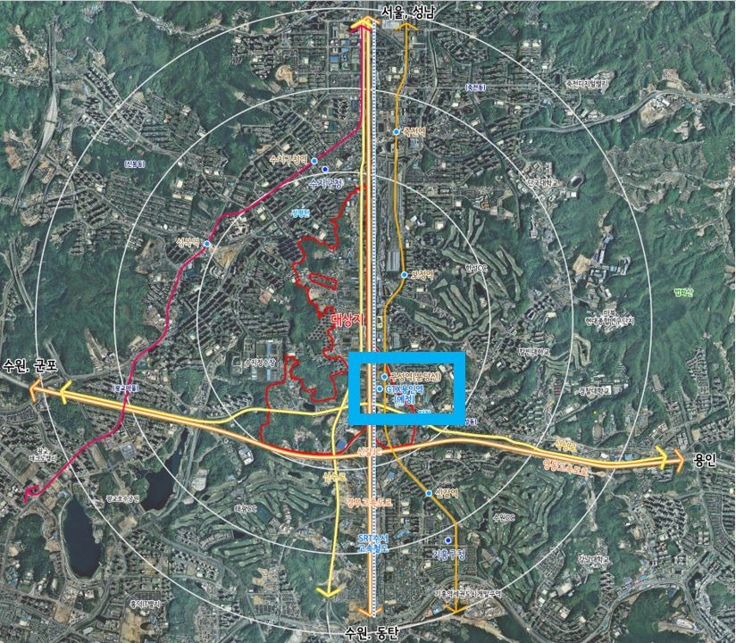

안녕하세요. 데일리리뮤입니다. 오늘은 GTX-A노선 용인역 인근의 플랫폼시티 개발 계획에 대해 소개해드리고자 합니다.

GTX-A 용인역 인근(현재 분당선 구성역 인근)은 2018년부터 관련 계획이 공식적으로 추진되어 왔으며, 올해 토지보상에 착수한다고 하나, 언제나 그렇듯 순탄히 끝날지는 장담할 수 없겠죠. 여하튼 현재 용인시에서 고시한 개발정보를 간단히 살펴보면

- 21년 상반기 : 개발계획 승인
- 22년 3월 : 실시계획 승인
- 23년 1월 : 공사착공
- 28년 12월 : 공사준공

위와 같은 계획이 예정되어있습니다. 대상지의 면적은 83만평, 275만 제곱미터(참고로 이는 1기 신도시 분당의 약 15%에 해당하는 크기입니다. 분당이 세종 이전 우리나라에서 가장 큰 신도시임을 감안하더라도 플랫폼시티가 크진 않네요.) 계획하는 세대수는 약 11,000세대이며, 이중 민간분양 물량이 절반 가량이 예정되어 있다고 합니다.

### 교통

#### 1\. GTX-A

용인 플랫폼시티에 여러 교통 계획, 그리고 이미 갖춘 교통 인프라가 있지만 이 중 가장 강력한 GTX-A 노선입니다. 현재 분당선구성역 인근에 위치한 GTX-A 용인역은 2024년 개통 예정이며, 일자리가 밀집한 성남역(판교)까지 약 10분내 삼성역까지 약 15분내에 이동가능할 것으로 보입니다.

#### 2\. 복합환승센터

용인 플랫폼시티의 복합환승센터는 용산 복합환승센터(13만제곱미터)보다 큰 14만제곱미터 규모가 들어선다고 합니다.

복합환승센터 관련한 계획으로, GTX 노선과 버스, 지하철(구성역)과 3분 이내에 환승이 가능하도록 하는 상공형 환승센터(쉽게 말하자면, 다리 위에 환승센터)를 국토교통부 시범사업에 제안하였고 우수 사례로 선정(2020년 11월)된바 있습니다. 용인시는 23년 사업계획이 승인되면 25년까지 준공을 목표로 하고 있다고 하네요.

용인역은 경부고속도로, 영동고속도로와 인접해 있어, 이 사업이 현실화되면 수도권의 주요한 교통 허브가 될 것으로 보이며, 플랫폼시티에서의 서울, 수도권, 지방에 대한 교통 접근성이 매우 우수할 것으로 예상됩니다.

이와 함께 구성역 인근 보정IC가 신설되어 경부고속도로 접근성 또한 이전에 비해 크게 개선될 예정이라고 하네요.

### 일자리

플랫폼시티는 자족기능을 강화한 도시로 설계되었으며, 전체 275만 제곱미터 중 44만 제곱미터를 첨단 산업용지, 21만 제곱미터를 상업용지로 계획하였습니다. 이 중 첨단 산업용지에는 IT, BT(바이오), 친환경 첨단 기업을 유치할 계획이라고 하는데 잘되면 좋겠습니다.

올해초 용인시 보도자료에 의하면, 재작년 대규모 투자로 화제가 되었던 SK하이닉스 용인 반도체 클러스터(처인구 원삼면 일대)와 플랫폼시티에서 17만개(판교 테크노밸리의 근로자수는 약 6만명)의 일자리 창출을 목표하고 있다고 하니, 계획의 절반만 달성하여도 좋겠네요.

이상으로 GTX-A 용인역 인근 개발계획을 알아보았습니다.

아직 준공까지 많은 기간이 남아있지만 꾸준히 모니터링하셔야할 지역으로 생각됩니다. 읽어주셔서 감사합니다.

아래 부동산 질문게시판에 부동산 질문 남겨주시면 사소한 것도 최대한 답변드리겠습니다. [부동산 질문게시판](https://www.dailyremu.com/?page_id=461&mod=list)
