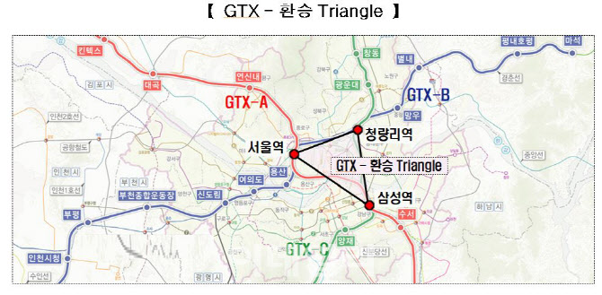
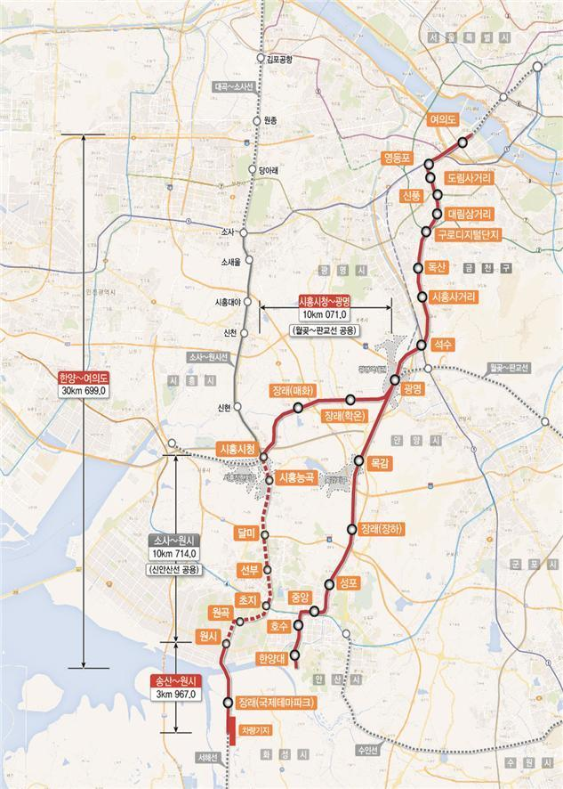
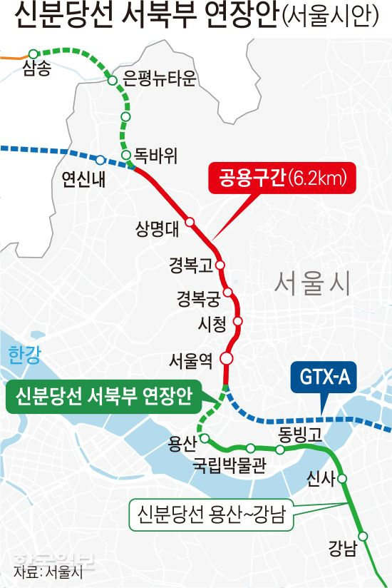
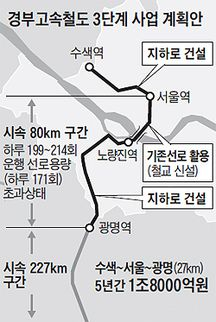
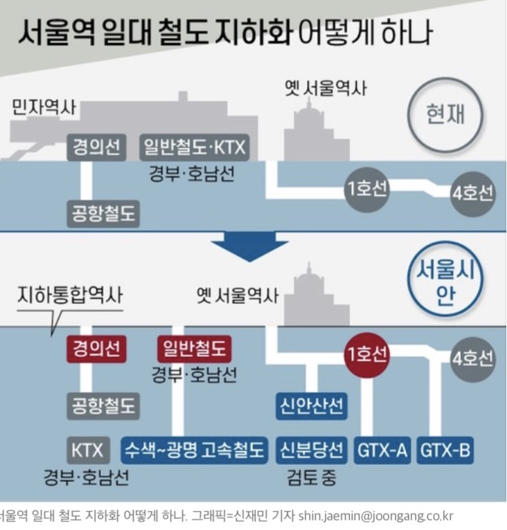
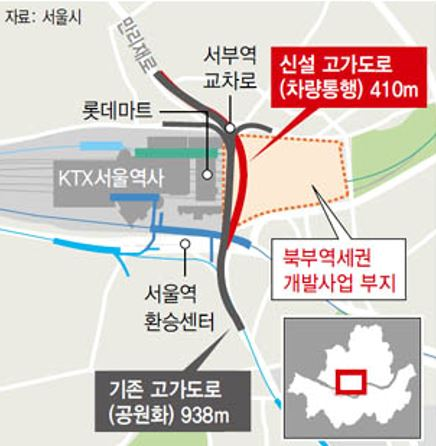

안녕하세요. 데일리리뮤입니다. 오늘은 GTX-A노선 서울역 향후 예정, 혹은 계획 중인 교통호재 및 북부역세권 개발계획에 대해 말씀드리겠습니다.

현재 서울역에는 1호선, 4호선, 경의중앙선, 공항철도, KTX가 들어서 있습니다. 지금도 많은 노선이 있지만 앞으로는 GTX, 신안산선, 신분당선 등 추가 개통이 예정되어 있거나 예비타당성 조사를 받기 위해 계획하고 있습니다.

### GTX-A, GTX-B

서울역은 삼성역, 청량리역과 함께 GTX 환승이 가능한 GTX 트라이앵글로 불리웁니다. 서울역에서는 GTX-A노선(24년 개통예정), B노선(27년 개통예정)을 환승할 수 있는데요. GTX-A노선으로 파주~동탄까지, GTX-B노선으로 인천송도~남양주까지 빠른 시간 내에 이동이 가능합니다.

보통 GTX 관련 글이나 영상을 보면 "수도권 지역에서 삼성역, 서울역까지 몇분이 걸린다!" 라는 문구를 자주 보셨을텐데요.

GTX는 해당 수도권 지역에도 호재이지만, 아래 GTX 환승 트라이앵글 역에게 더 큰 호재입니다. 이동 시간을 단축시켜 일자리, 문화 기능 등을 흡수할 수 있기 때문입니다.

<figure>

<figcaption>

이미지출처 : 이데일리

</figcaption>

</figure>

GTX-A노선, B노선 개통만으로도 서울의 일자리가 모여있는 여의도, 강남 일대에 5~10분이내에 도착 가능하여 GTX 개통만으로도 서울역의 교통 수준은 엄청나보입니다.

### 신안산선, 신분당선, KTX(수색~광명)

신안산선, 신분당선, KTX(수색~광명) 노선은 모두 예비타당성조사 문턱을 넘지 못한 사업들입니다. 하지만 아래서 살펴볼 서울시의 복합환승센터 사업계획을 참고하여볼 때 지속적으로 추진할 사업으로 보입니다.

#### 1\. 신안산선

신안산선 1단계는 여의도역~한양대역까지 놓이는 노선이며, 24년 개통예정입니다. 이 노선의 2단계 연장을 계획하고 있으며, 20년 5월 사전타당성조사 진행하기 시작했다고 합니다. (사전타당성조사는 예비타당성조사 이전에 사업 건의를 위한 사업성을 검증 단계라고 하네요.)

<figure>

<figcaption>

이미지 출처 : 국토교통부

</figcaption>

</figure>

#### 2\. 신분당선

신분당선은 아시다시피 강남~광교에 놓인 노선인데요. 24년까지 강남~신사까지 연장, 27년까지 용산역까지 연장될 계획입니다. 이에 더해 용산역에서 서울역을 거쳐 삼송역까지 이르는 노선 연장에 대한 계획이 있으며, 이도 마찬가지로 아직 예비타당성조사도 받지 못한 상태입니다.

<figure>

<figcaption>

이미지출처 : 한국일보

</figcaption>

</figure>

#### 3\. 수색~광명 KTX

수색~광명 KTX 사업은 3단계 KTX 사업으로 불리며, 수색역에서 서울역을 거쳐 광명역에 도착하는 지하 KTX 노선입니다. 현재 서울역에서 광명역까지 새마을호, 무궁화호 등과 노선을 공유하여 15분 이상 소요된다고 합니다. 이를 개선하기 위해 수색~광명 KTX 지하노선을 신설하려는 계획입니다. 이 사업은 19년 7월 예비타당성조사 대상에 선정되었다고 합니다. (이후 진행상황은 찾지 못하여 19년 7월이후 다른 진행 사항 있다면, 댓글로 남겨주시면 바로 반영하도록 하겠습니다.)

<figure>

<figcaption>

이미지출처 : 조선일보

</figcaption>

</figure>

### 서울역 복합환승센터

위에서 살펴본 노선 간의 환승을 돕기 위한 시설이 복합환승센터입니다. 현재 서울역은 공항철도, 1호선, 4호선, 버스 등을 환승하기 위해 꽤 긴 동선을 걸어야 합니다.

이런 동선을 깔끔하게 정리하기 위한 사업이 복합환승센터이며, 대부분 GTX역에 이러한 복합환승센터 설계가 진행되고 있습니다.

서울역 복합환승센터의 계획은 서울시 의견, 국토교통부 의견이 갈리는 상황이라고 하는데요.

20년 11월 중앙일보 기사에 따르면 서울시가 KTX, GTX, 경의중앙선 지하화를 위한 TF를 구성하였다고 합니다.

<figure>

<figcaption>

이미지 출처 : 중앙일보

</figcaption>

</figure>

위 그림을 보시면 현재 서울역에 들어선 노선 이외에도 예정된 노선들이 지하에 위치하는 것을 살펴볼수 있습니다.

이 안에 대해 국토교통부는 예산을 문제 삼아 반대하고 있는데요, 서울시는 신도림, 구로까지 지상철을 지하화할 계획을 제시하고 있는 상황이라고 합니다.

아직 계획단계이지만 서울역 뿐만 아니라, 서남권 개발계획에도 영향을 주는 사안인 만큼 앞으로도 진행되는 상황을 눈여겨볼만하다고 생각됩니다.

### 서울역 북부역세권 개발사업

<figure>

<figcaption>

이미지 출처 : 한겨레, 서울시

</figcaption>

</figure>

서울역 북부역세권 개발사업은 서울역 북부 유휴부지 5만제곱미터(코엑스몰 부지는 18만제곱미터)에 호텔, 컨벤션, 상업시설을 건설하는 사업입니다. (강북 코엑스라고 기사를 내는 것 같던데 그정도 규모는 아니네요.)

19년 한화컨소시엄(한화건설, 한화호텔앤리조트 등)이 사업자로 선정되어 협상이 진행되고 있는 것으로 보입니다. 20년 5월 한국경제 기사에 따르면 착공시기는 협상 속도에 따라 이르면 21년이라고 언급하였으나, 아직 추가 소식은 없는 것으로 보입니다.

오늘은 GTX-A 서울역 교통 호재 및 주변 개발 계획에 대해 알아보았습니다. 서울역 인근은 아직 개발되지 않은 지역이 많이 있습니다. 이렇게나 많은 교통호재로 주변 지역이 어떻게 바뀌어갈지 기대가 되네요. 읽어주셔서 감사합니다. 오늘도 좋은하루 보내시기 바랍니다.

아래 부동산 질문게시판에 부동산 질문 남겨주시면 사소한 것도 최대한 답변드리겠습니다. [부동산 질문게시판](https://www.dailyremu.com/?page_id=461&mod=list)
