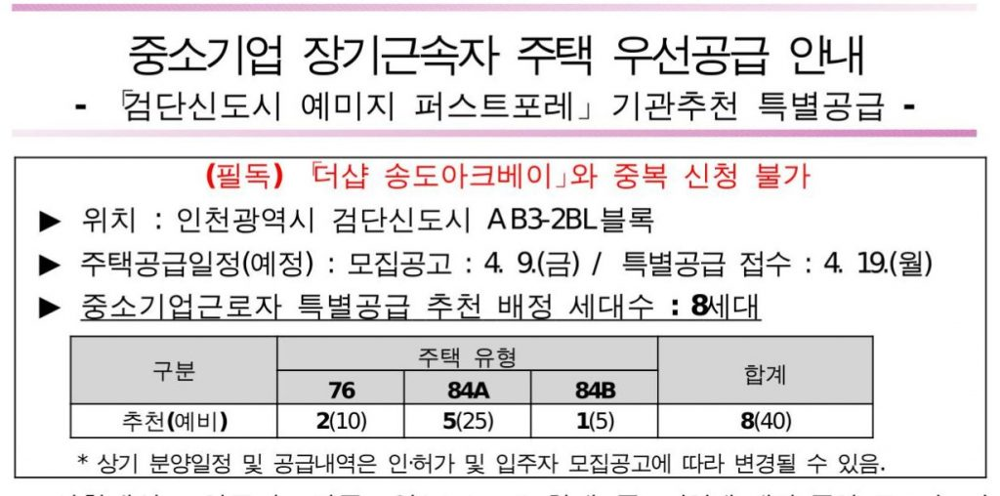
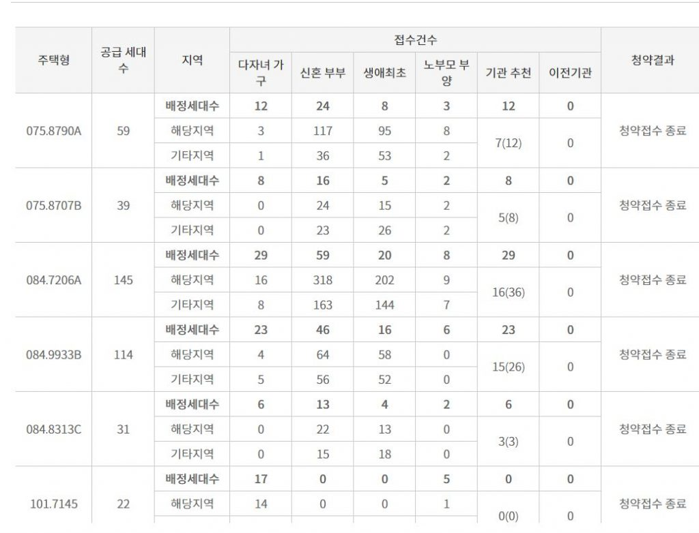
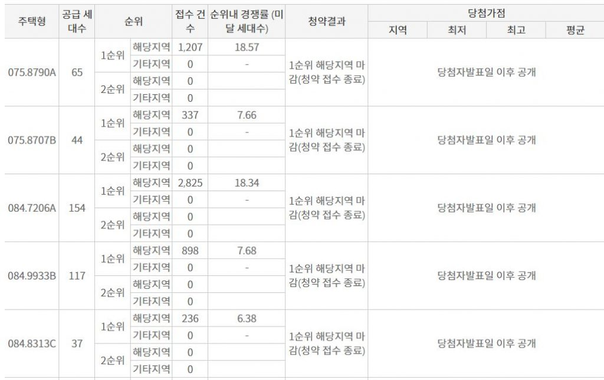

안녕하세요. 데일리리뮤입니다. 오늘은 검단 예미지의 모집공고 및 청약예정일을 알아보고, 3월 22일부터 특별공급, 일반공급이 진행된 시티오씨엘 3단지의 경쟁률을 알아보도록 하겠습니다.

### 검단 예미지 퍼스트포레 모집공고 및 청약 예정일

검단 예미지 퍼스트포레의 모집공고 발표 예정일이 공고되었습니다. 해당 소식은 인천지방중소기업청의 "중소기업 장기근로자 주택 우선공급" 모집공고에서 알 수 있는데요.

<figure>

<figcaption>

이미지 출처 : 인천지방중소기업청

</figcaption>

</figure>

모집공고 예정일은 4.9(금), 특별공급 접수일은 4.19(월)로 예정되어있습니다.

우미린 파크뷰의 모집공고 예정일도 위 특별공급 일정을 통해 가늠해볼 수 있었는데, 우미린 파크뷰의 이전 3월 18일에 예정되있던 일정이 지연된 것을 볼 때, 검단 예미지 퍼스트포레도 지연의 가능성이 없진 않습니다.

청약을 준비하시는 입장에서는 모집공고(예정) 이전일인 4월 8일까지 지역별 청약통장 예치금액을 맞추고 특별공급 등 청약자격을 준비할 시간 정도로 참고하시면 좋겠네요.

## 시티오씨엘 3단지 청약경쟁률(검단신도시 경쟁률 참고자료)

참고자료로 작성하기에 앞서 검단신도시 향후 분양예정물량과의 차이점을 말씀드리자면,

용현학익지구는 분양가상한제 미적용지역으로 입주자선정 이후 3년 시점에 전매가 가능하나, 검단신도시는 분양가상한제가 적용되는 공공택지지구로 주변시세 대비 분양가에 따라 5~10년 이후에 전매가 가능합니다.

아래에 작성한 시티오씨엘 3단지와 검단신도시 향후분양물량은 지역의 차이, 적용되는 제도의 차이가 있다는 점을 알아두세요ㅎㅎㅎ

3월 22일부터 진행된 특별공급이 시티오씨엘 3단지의 신혼부부 특별공급 경쟁률은 84타입 약 8대1부터 약 3대1 수준이었습니다.

<figure>

<figcaption>

이미지 출처 : 청약홈

</figcaption>

</figure>

84타입의 일반공급의 경쟁률은 최대 18.34대1부터 6.38대1에 이르는 경쟁률을 보였습니다.

<figure>

<figcaption>

이미지 출처 : 청약홈

</figcaption>

</figure>

검단신도시는 용현학익지구에 비해 전매제한 등 조건이 까다롭지만 주변시세가 높게 형성되어있습니다. 이러한 점을 참고하시어 청약전략을 세우시기 바랍니다.

읽어주셔서 감사합니다. 오늘도 좋은하루 되세요

아래 부동산 질문게시판에 부동산 질문 남겨주시면 사소한 것도 최대한 답변드리겠습니다. [부동산 질문게시판](https://www.dailyremu.com/?page_id=461&mod=list)
