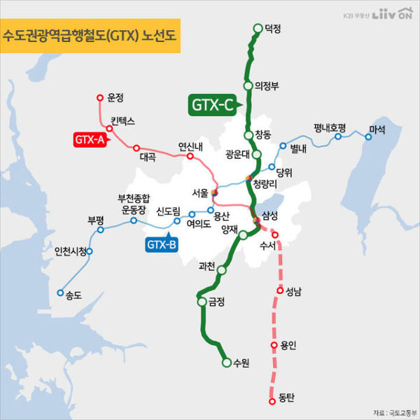
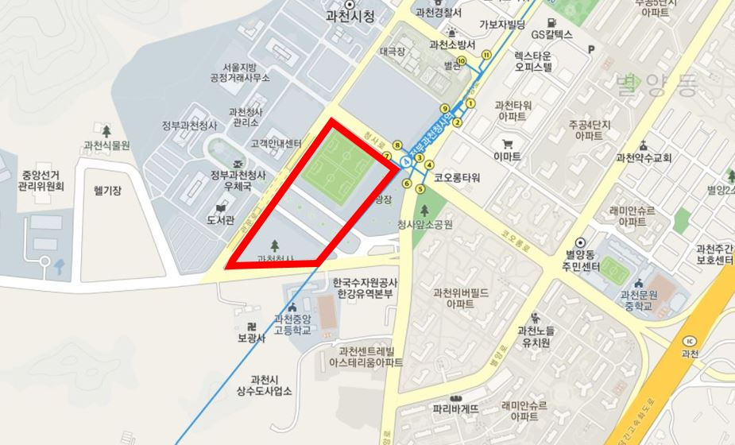
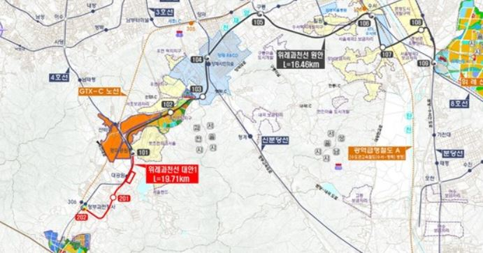
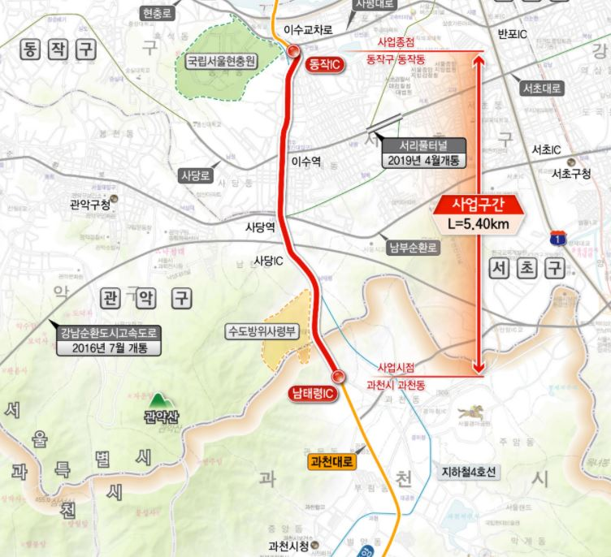
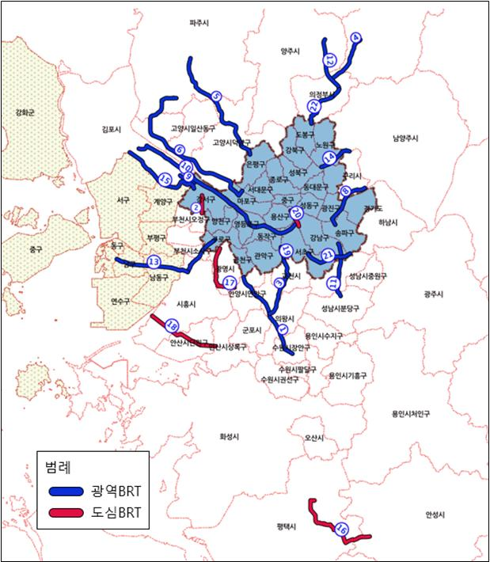

안녕하세요. 데일리리뮤입니다.

오늘은 GTX-C노선 26년말 개통예정인 과천역 인근 교통호재에 대해 알아보겠습니다. 현재 예정된 GTX-C 과천역은 4호선 정부청사역 인근에 지어질 예정입니다. 이외에도 복합환승센터, 위례과천선, 이수~과천 복합터널, 안양~사당 BRT 계획 등이 예정되어 있습니다.

### GTX-C 과천역

GTX-C노선은 양주 덕정에서부터 수원까지 가는 노선(총 10개역, 덕정, 의정부, 창동, 광운대, 청량리, 삼성, 양재, 과천, 금정, 수원) 입니다. 계획으로는 26년 말 개통예정이며, 과천역에서 양재역까지 3분, 삼성역까지 7분 가량 소요될 예정입니다.

참고로 국토교통부가 21년 1월 고시한 'GTX-C노선 시설사업 기본 계획'에 따르면 민간 사업자가 현재 기본계획상 예정된 10개 역 외에 추가역을 제안하여 신설할 수 있다는 내용이 있습니다. 현재 인덕원, 의왕 등 각 지자체에서 추가 역에 대한 청원이 지속적으로 이뤄지고 있어 의견 반영시 역이 추가 지정될 수 있습니다.

<figure>

<figcaption>

이미지 출처 : 이슈게이트, KB Liiv on

</figcaption>

</figure>

### 과천청사역 복합환승센터

복합환승센터는 대중교통 이용객의 동선을 효율화하여 GTX, 지하철, 버스와의 환승시간을 3분 이내로 줄이기 위한 사업입니다.

과천시는 4호선, 버스노선, 향후 개통될 위례-과천선 등과 연계할 계획을 검토하는것으로 보이며, GTX-C 노선이 현재 과천 청사 유휴지 4번지 지하에 건립되는 것으로 전해져 복합환승센터도 해당 위치 인근(과천청사역 유휴지 4, 5번지)에 지어질 가능성이 높아 보입니다.

참고로 기사에 따르면 과천시는 복합환승센터 부지로 선바위역과 정부청사역 유휴지 부지를 검토하고 있는 것으로 알려져 있습니다.

<figure>

<figcaption>

이미지 출처: 카카오맵

</figcaption>

</figure>

### 위례 과천선

위례 과천선은 복정역(8호선), 수서역(3호선, 분당선, GTX-A) 양재시민의숲역(신분당선), 경마공원역(4호선), 정부과천청사역(4호선, GTX-C) 등을 지나는 것으로 예정된 노선입니다.

2008년부터 위례신도시 교통대책으로 논의되어왔으나, 사업성 부족으로 진척되지 않아왔습니다. 기존 사업성이 검토된 노선은 4호선 경마공원역~복정역 구간이었으나, 2020년 국토교통부에서 3기신도시 발표 등 기타 현안과 함께 위례 과천선의 정부청사역 연장안을 발표했습니다.

해당 노선의 사업성은 0.93으로 1에 미치지 못하나 여태 나왔던 사업성 중 가장 높은수치라고 합니다. 21년 전문가 심의에서 통과되면 예비타당성 조사를 받게 되고 이르면 27년 개통 예정이라하네요.

개통된다면 신분당선, GTX-A, 3호선 환승역과 매우 가까워져 강남접근성이 매우 개선될 것으로 보입니다.

<figure>

<figcaption>

이미지 출처 : 과천넷

</figcaption>

</figure>

### 이수~과천 복합터널, 안양~사당 BRT

#### 이수~과천 복합터널

이수~과천 터널은 남태령IC에서 동작IC로 이어지는 터널이며, 예정된 계획은 22년 착공, 26년 개통이며, 서울시는 21년 상반기 현재 민간사업자 제안서를 제출받고 있습니다. 하루 빨리 개통되어 남태령고개의 상습정체를 싹 날려버리면 좋겠습니다.

<figure>

<figcaption>

이미지 출처 : 교통방송, 기재부

</figcaption>

</figure>

#### 안양~사당 BRT

BRT란 간선급행버스체계로 버스우선신호, 전용노선으로 버스를 지하철과 같이 운영하는 시스템입니다. 현재 수도권에서 22개의 노선이 추진되고 있으며, 교차로 등에서 버스접근시 버스에게 우선 신호를 부여하는 방법으로 정시성을 강화하는 역할을 한다고 하네요.

<figure>

<figcaption>

이미지 출처 : 경기일보

</figcaption>

</figure>

이러한 BRT 안양-사당 노선 사업이 20년 4월 기준 사전타당성조사 단계에 진입하였다고 합니다. 해당 사업은 전철과 달리 사업비가 적고, 공사기간이 짧아 착공에 들어가면 2년내에 준공될 것으로 예상됩니다. 현재도 버스전용노선으로 과천에서 사당역까지 10분내에 진입이 가능한데, 신호까지 버스위주로 개선한다면, 과천에서 사당은 5~7분내에 진입가능하지 않을까 싶습니다.

오늘은 GTX-C 과천역 및 인근 교통 호재에 대해 정리해보았습니다. 읽어주셔서 감사합니다. 행복한 하루보내세요.

아래 부동산 질문게시판에 부동산 질문 남겨주시면 사소한 것도 최대한 답변드리겠습니다. [부동산 질문게시판](https://www.dailyremu.com/?page_id=461&mod=list)
