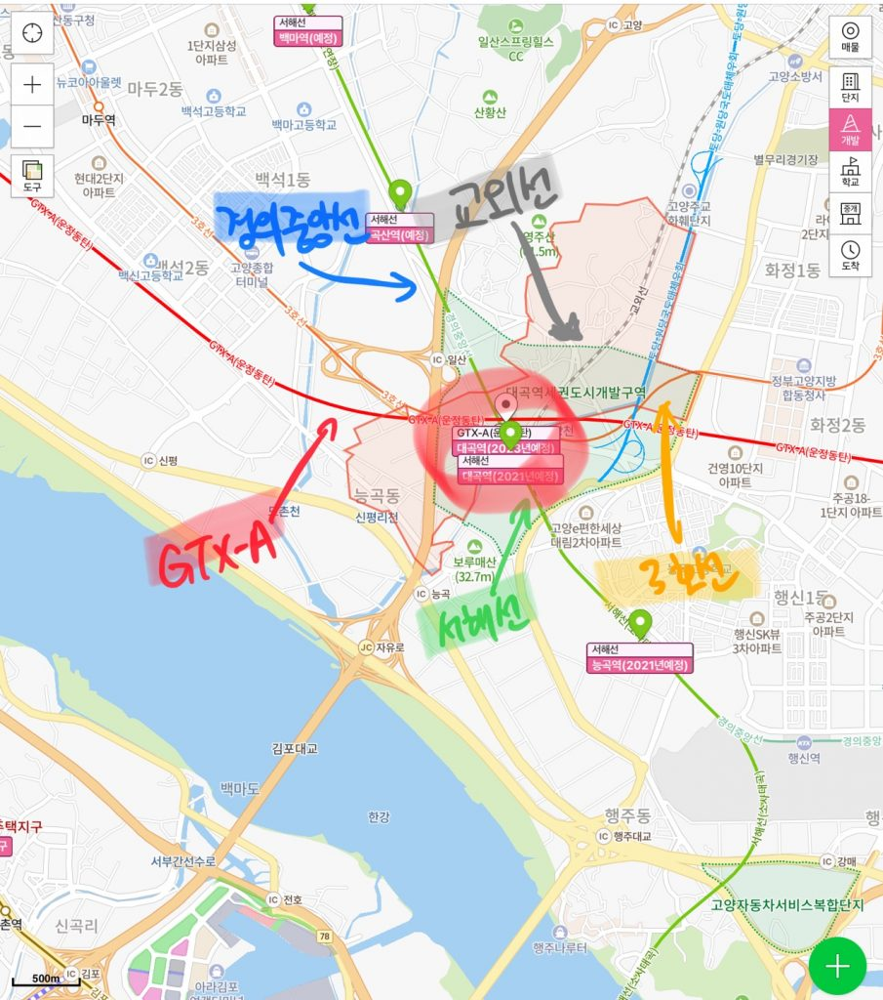
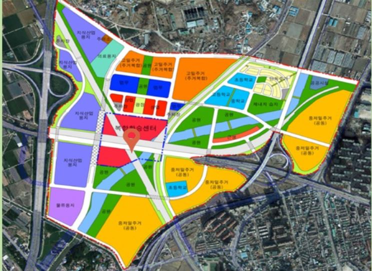
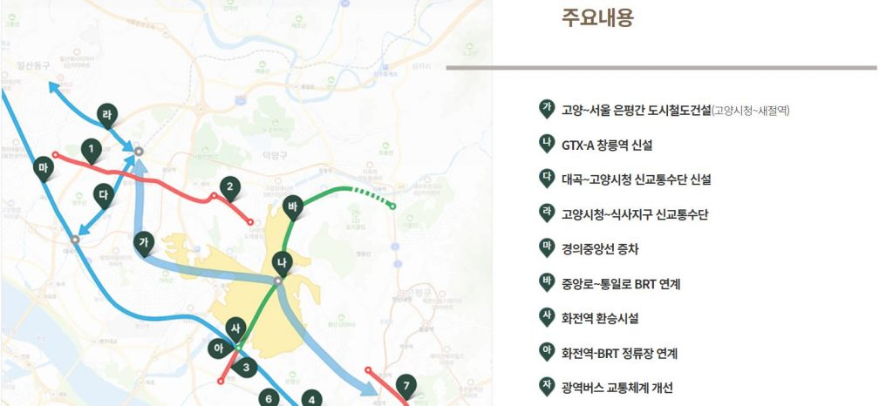

안녕하세요. 데일리리뮤입니다.

오늘은 GTX-A노선 대곡역의 개통예정 노선과 역세권 개발사업, 그리고 20년 추가발표된 GTX-A 창릉역에 대해 간단히 소개해드리겠습니다.

### GTX-A 대곡역

GTX-A 대곡역은 고양시에 예정된 역사로 삼성역까지는 약 18분 가량 소요될 것으로 생각됩니다.

현재는 3호선과 경의중앙선이 위치하고 있으며, 주변은 아직 논밭이며, 토지거래허가구역으로 묶여있습니다.

<figure>

<figcaption>

이미지출처 : 네이버부동산

</figcaption>

</figure>

이 대곡역에 GTX-A, 서해선(소사~김포공항~대곡, 22년 개통예정), 교외선(능곡~대곡~의정부, 이르면 24년개통)이 계획되어 있습니다. 아직은 구체적인 계획이 없는 홍대~통일전망대선까지 대곡역에는 총6개 노선이 계획되어 있습니다.

참고로 고양선(새절역~대곡~고양시청~일산역, 이르면 27년 개통)은 기존 대곡역을 지나는 것으로 계획되었으나, 20년 12월 GTX-A 창릉역 신설에 따라 대곡역을 미경유하고 창릉역을 경유하는 노선으로 수정되었습니다.

### 대곡역 역세권 개발사업 및 복합환승센터

대곡역 역세권 개발사업 및 복합환승센터는 일정은 계획되어 있으나, 아직 불투명한 계획으로 변동될 확률이 매우 높습니다.

고양도시관리공사 사업안내에 따르면 대곡역 역세권 개발은 180만제곱미터터에 1.9조원의 사업비를 들여 28년까지 준공할 계획입니다.

<figure>

<figcaption>

이미지 출처 : 매일경제

</figcaption>

</figure>

20년 6월 고양신문 기사에 따르면, 대곡역 주변부는 그린벨트로 묶여있어 복합환승센터 건설을 위한 소규모 부지의 그린벨트 해제는 어렵다고 합니다. 따라서 역세권 개발사업과 함께 진행되어야만 하는데, 19년 역세권 개발사업의 예비타당성조사 탈락 등으로 현재 진행에 어려움을 겪고 있다고 합니다.

아직 구체적인 역세권 개발사업, 복합환승센터에 대한 계획은 찾아볼 수 없습니다. 그럼에도 대곡역은 추후 서북권의 교통의 핵심요지로 떠오를 것이라는 점에서 아직 시간이 필요하지만 분명 크게 성장할 곳이라는 것을 알 수 있습니다.

### GTX-A 창릉역

정부가 3기신도시 교통대책으로 20년 12월 발표한 창릉지구 광역교통개선대책에 GTX 창릉역에 대한 내용이 발표되었습니다.

GTX-A 창릉역 신설(아래 그림의 "나")뿐 아니라, 새절역~고양시청 도시철도(아래 그림의 "가"), 경의중앙선 화전역(아래 그림의 "사")까지의 BRT(간선급행버스) 노선이 추진된다고 합니다.

3기신도시들이 선교통 후개발을 표방하고 있는 만큼 해당 노선들은 창릉지구 사업준공(예정) 시점인 29년 이전 완료하는 것으로 계획되었을 것입니다.

<figure>

<figcaption>

이미지 출처 : 3기신도시.kr

</figcaption>

</figure>

오늘은 5개 노선 개통이 계획된 대곡역 및 인근 개발계획, 그리고 GTX-A 창릉역 교통계획에 대해 간략히 소개하였습니다. 아직까지 개발시기 등은 구체적이지 않으나, 성장 잠재력이 높은 지역으로 보이네요. 꾸준히 지켜보며 업데이트 해보겠습니다.

읽어주셔서 감사합니다. 좋은하루되세요.

아래 부동산 질문게시판에 부동산 질문 남겨주시면 사소한 것도 최대한 답변드리겠습니다. [부동산 질문게시판](https://www.dailyremu.com/?page_id=461&mod=list)
