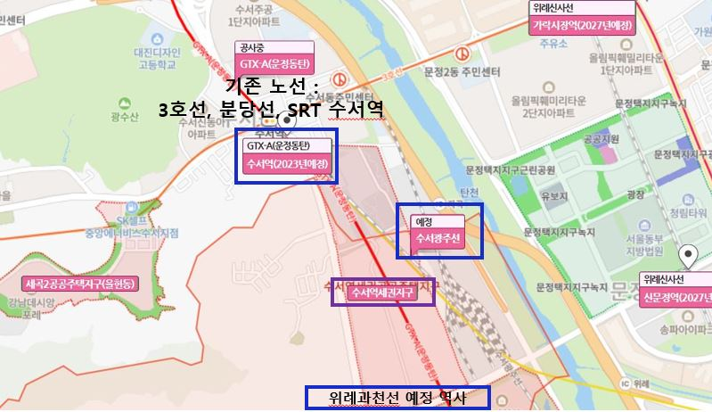
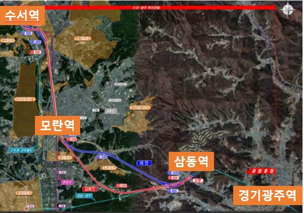
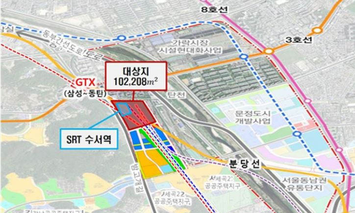
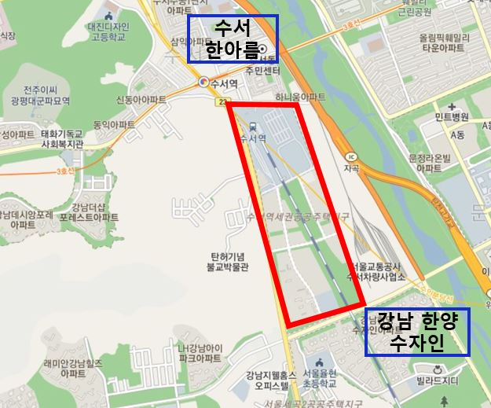

안녕하세요. 데일리리뮤입니다. 오늘은 GTX-A 노선 수서역 노선 및 향후 개통 계획에 대해 알아보고, 진행 중인 역세권 개발 사업 및 주변 아파트 시세에 대해 알아보도록 하겠습니다.

### 수서역 노선 및 개통예정 노선

먼저, 현재 수서역에는 분당선, 3호선, SRT 노선이 지나고 있습니다. 여기에 27년 개통예정인 GTX-A 수서역과 수서~광주(경기)선이 계획되어있습니다.

여기에 27년 개통예정인 GTX-A 수서역과 수서~광주(경기)선이 계획되어있습니다. 또한 아래 지도에서 보실수 있는 수서역세권지구 바로 아래쪽에는 위례~과천선(27년 개통예정)역사 또한 예정되어있습니다.

<figure>

<figcaption>

이미지 출처 : 네이버부동산

</figcaption>

</figure>

수서~광주선은 2019년 7월 KDI 예비타당성조사를 통과하였으며, 수서역에서 모란역, 삼동역을 거쳐 경기광주역에 이르는 노선입니다. 현재 착공은 23년 및 준공은 27년으로 예정되어있습니다.

<figure>

<figcaption>

이미지 출처 : KDI 예비타당성조사 보고서

</figcaption>

</figure>

### 수서역세권 개발사업

GTX 노선, SRT, 3호선, 위례과천선 등 총 6개 노선이 놓이는 역세권에는 역세권 개발사업이 빠지지 않죠. 약 10만 제곱미터에 업무, 유통, 주거시설 건설을 목표로 하고 있으며, 21년 5월 사업주관자 선정 및 23년 착공을 계획하고 있습니다. 현재 이 사업에 현대산업개발, 한화, 신세계가 이 사업에 관심을 보이고 있다고 하네요.

<figure>

<figcaption>

이미지 출처 : CEO SCORE Daily

</figcaption>

</figure>

### 인근 아파트 시세

인근 아파트로는 수서역세권 지구 북쪽 수서한아름 단지와 남쪽 강남 한양수자인 단지 등이 있습니다.

<figure>

<figcaption>

이미지 출처 : 카카오맵

</figcaption>

</figure>

수서 한아름은 93년 준공된 498세대 단지입니다. 현재 수서역 노선인 3호선, 분당선 초역세권단지입니다. 36평형 실거래가는 호갱노노 기준 20년 11월 2층 16억 4천만원, 20년 10월 5층 16억이었네요.

강남 한양 수자인은 2014년 준공된 1300여 세대의 대단지이며, 향후 개통될 위례과천선 초역세권 단지입니다. 34평형 실거래가는 호갱노노 기준 최근 실거래가는 21년 2월 6층 16.8억, 20년 7월 1층 15.4억이었습니다.

오늘은 GTX-A 수서역 개통 예정 노선 및 인근 개발계획, 단지시세를 간단히 알아보았습니다. 읽어주셔서 감사합니다. 좋은 하루되세요.

아래 부동산 질문게시판에 부동산 질문 남겨주시면 사소한 것도 최대한 답변드리겠습니다. [부동산 질문게시판](https://www.dailyremu.com/?page_id=461&mod=list)
