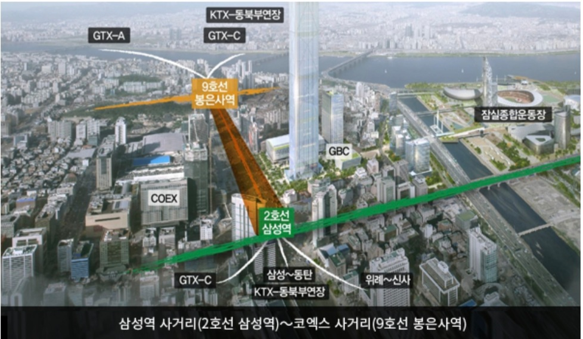
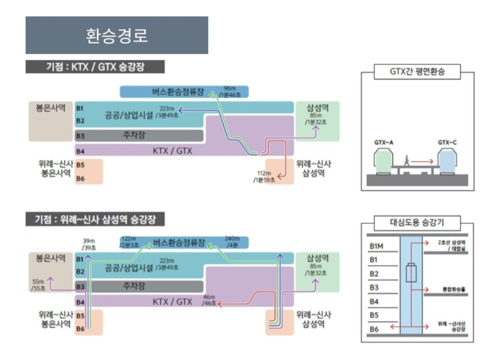
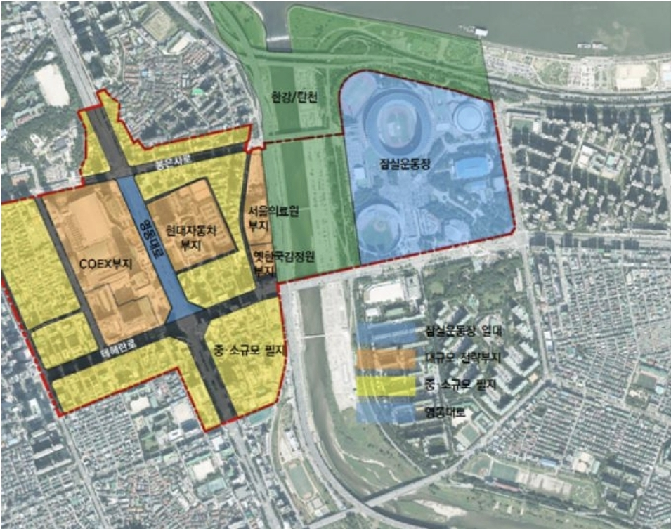
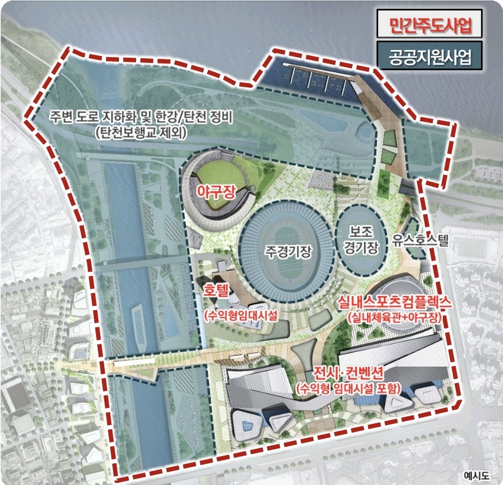

안녕하세요. 데일리리뮤입니다.

오늘은 GTX-A 삼성역 개통 예정노선, 복합환승센터 및 인근 개발계획인 국제교류복합지구에 대해 소개해드리겠습니다.

### GTX-A 삼성역 및 복합환승센터

먼저 삼성역에는 현재 2호선이 지나고 있으며, 600m 거리에 9호선 봉은사역이 위치하고 있습니다. 이 사이에 GTX-A(GTX노선은 24년 개통예정이나 복합환승센터 공사지연으로 삼성역은 27년 개통예정), GTX-C(27년 개통예정), 위례신사선(27년 개통예정), KTX 동북부선(수서~의정부, 검토 중인 노선) 노선이 예정되어있습니다. GTX노선은 수도권 지역에도 호재이지만 GTX 노선들이 모이는 삼성역에는 더 큰 호재입니다.

<figure>

<figcaption>

이미지 출처 : 국토교통부 대도시광역교통위원회

</figcaption>

</figure>

GTX 역사 대부분에는 복합환승센터가 지어지는데요. 삼성역도 마찬가지입니다. 지상은 코엑스와 현대차그룹의 GBC가 이어지는 보행광장이 꾸며지고, 지하에는 도로 및 버스정류장, 주차장, 지하철, GTX, KTX 환승정류장이 계획되어있습니다.

<figure>

<figcaption>

이미지 출처 : 국토교통부 대도시광역교통위원회

</figcaption>

</figure>

### 국제교류복합지구

국제교류복합지구 개발사업은 코엑스, GBC, 잠실운동장 일대 199만제곱미터(판교테크노밸리가 60만제곱미터이니, 무려 3배규모이네요) 를 컨벤션, 국제교류, 국제회의 중심지로 개발하려는 사업입니다.

<figure>

<figcaption>

이미지 출처 : 서울시

</figcaption>

</figure>

GBC(현대자동차) 부지에는 당초 100층 이상 본사 사옥을 계획하고 있었으나, 현재 50층 3개동으로 설계를 변경하여 진행되고 있다 합니다.

잠실운동장 일대 국제교류복합지구 사업은 22년 착공, 25년 준공 예정입니다.

잠실 주경기장은 역사성을 감안하여 리모델링으로 진행하며, 기존 잠실 야구장이 한강조망이 가능하도록 한강변에 이전하여 건설될 예정입니다. 이뿐 아니라 호텔, 컨벤션센터, 실내체육관의 건설 또한 계획되어있습니다.

주경기장 서쪽 탄천, 한강 주변을 여가, 생태체험 공간으로 조성하는 계획도 예정되어있습니다.

<figure>

<figcaption>

이미지 출처 : 서울시

</figcaption>

</figure>

읽어주셔서 감사합니다. 좋은 하루 되세요.

아래 부동산 질문게시판에 부동산 질문 남겨주시면 사소한 것도 최대한 답변드리겠습니다. [부동산 질문게시판](https://www.dailyremu.com/?page_id=461&mod=list)
