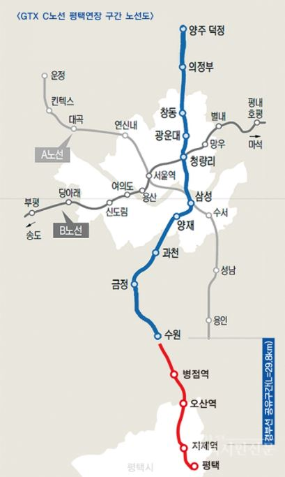
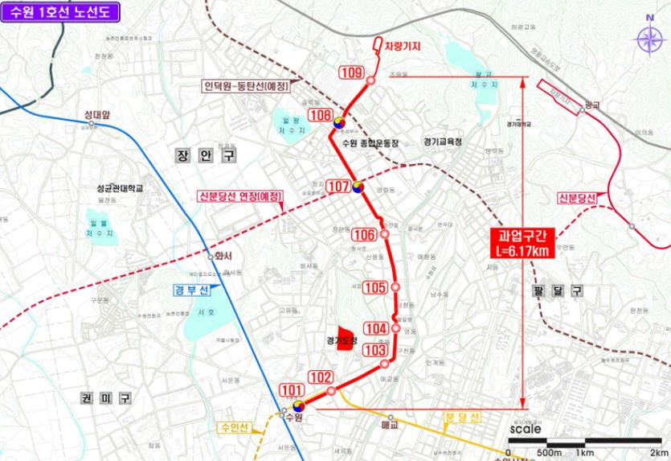
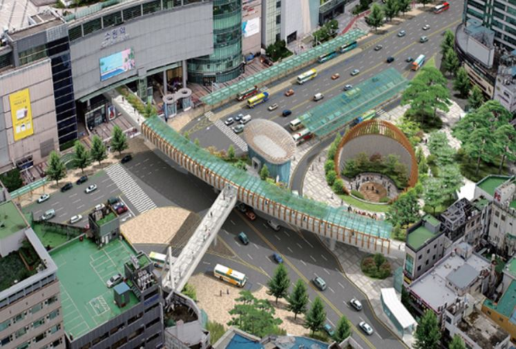
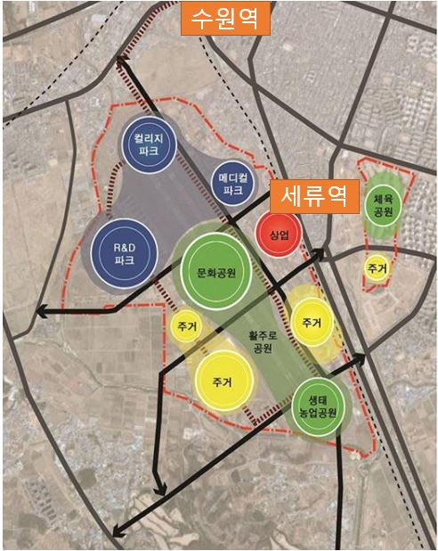
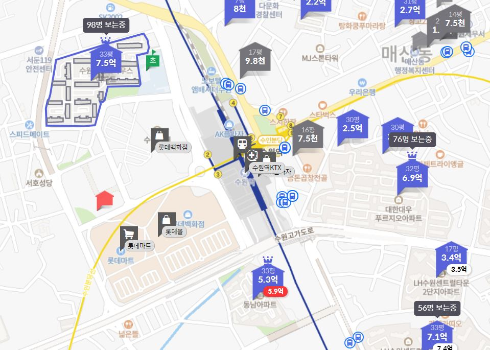

안녕하세요. 데일리리뮤입니다.

오늘은 GTX-C노선 수원역 개통 예정 노선(수원 도시철도 1호선,(feat. 신분당선 연장선, 인덕원~동탄선))과 인근 대규모 개발계획, 인근 아파트 시세에 대해 알아보도록하겠습니다.

### GTX-C 수원역

현재 수원역은 KTX, 1호선, 수인분당선이 지나고 있습니다.

이 곳에 GTX-C 수원역이 들어설 예정(이르면 27년)이며, 삼성역까지 22분 가량 소요될 예정입니다. (GTX-C노선은 국토부가 민간사업자가 3개역을 추가할 수 있도록 허용하여 중간에 생기는 역에 따라 시간은 변동될 수 있습니다.)

현재 종점은 수원역으로 계획되어 있으나, 평택 오산시에서 추가연장안에 대한 의견을 지속적으로 내고 있어 해당 내용도 지켜볼 필요가 있습니다.

<figure>

<figcaption>

이미지출처 : 평택시민신문

</figcaption>

</figure>

수원역에는 기존 노선외에도 수원 도시철도 1호선(수원 트램)이 들어서게됩니다. 해당 노선은 수원역에서 경기도청을 거쳐 수원 종합운동장으로 향하는 트램 노선으로 이 노선만으로는 파급력이 덜하지만, 신분당선 호매실 연장선(28년 예정)과 인덕원-동탄선(26년 예정)과 환승 가능하여 수원역의 다른 철도노선과 접근성을 높이는 노선이 될 것입니다.

신분당선 연장선과 인덕원~동탄선에 대해 간단히 말씀드리면 신분당선은 현재 광교~강남에 깔린 노선이며, 해당 노선을 용산~호매실역까지 연장하는 계획이 세워져 있습니다. 신분당선은 현재도 일자리가 많은 판교, 강남을 지나며 꽤 가치 있는 노선이지만, 향후 서울의 주요 개발지역이 될 용산까지 거치게 되면서 매우 가치 있는 노선이 될 것입니다.

인덕원~동탄선은 인덕원, 의왕, 북수원, 동탄에 계획된 노선으로 수도권 서남부 도심간 이동성을 높일 수 있는 노선입니다.

### 복합환승센터

국토교통부는 2020년 GTX 역들의 환승센터 시범사업에 대한 평가를 진행하였으며, 이중 수원역과 양재역이 최우수 환승센터로 선정되었습니다.

도보광장을 조성하여 역사 주변을 정리하고 수원역의 GTX, 1호선, 수인분당선, 버스 등 탑승수단 간 환승시간을 3분이내로 단축하는 것을 목표로 하고 있습니다. 환승 편의성이 좋아질수록 더 많은 유동인구가 몰리고 인근 부동산의 가치도 같이 올라갈 것으로 예상됩니다.

<figure>

<figcaption>

이미지출처 : 국토교통부

</figcaption>

</figure>

### 스마트폴리스

스마트폴리스는 현재 수원역, 세류역 일대의 군공항 부지 520만 제곱미터(판교신도시 규모가 900만 제곱미터입니다.)에 산업(IT,BT 등)단지, 주거단지, 공원 및 녹지를 조성하는 사업입니다.

GTX-A 용인역 인근에 계획된 용인 플랫폼시티의 부지 규모는 약 270만 제곱미터이며, 예상하는 일자리는 4만개임을 참고하여 볼때, 구체적인 계획에 따라 차이가 있겠지만 스마트폴리스의 부지가 훨씬 큰 만큼 그 이상의 일자리가 생겨날 수 있을 것으로 예상됩니다.

아쉽게도 일정과 관련하여서는 구체적인 군부대 이전 및 착공시점에 대해 공개된 자료는 찾아볼 수 없네요. 아시는 분이 있으시면 댓글로 알려주시면 감사하겠습니다.

GTX-A 용인역과 직접적인 비교는 어렵지만 GTX-A 용인역(분당선 구성역) 인근 단지(32평, 준공 20년이상)의 최근 실거래가가 8.5억~9.5억인 것을 참고하여 수원역과 스마트 폴리스 예정부지 인근의 아파트 시세도 살펴볼 필요가 있습니다.

<figure>

<figcaption>

이미지 출처 : 중앙일보

</figcaption>

</figure>

### 인근아파트 시세

수원역 서부 인근 아파트 단지로는 서둔동 센트라우스(2005년 준공), 평동동남(1999년 준공) 아파트 단지가 있습니다. 두 단지의 시세는 33평 기준 7.5억, 5.5억 수준으로 아직 꽤 저렴해 보입니다.

<figure>

<figcaption>

이미지 출처 ; 호갱노노

</figcaption>

</figure>

오늘은 GTX-C 수원역 인근 교통계획, 환승센터, 스마트폴리스에 대해 소개해드리고 수원역 인근 단지의 시세를 간단히 알아보았습니다. GTX역 주변은 개발계획이 정말 많네요. 이상으로 글을 마치겠습니다.

오늘도 좋은 하루되세요. 읽어주셔서 감사합니다.

아래 부동산 질문게시판에 부동산 질문 남겨주시면 사소한 것도 최대한 답변드리겠습니다. [부동산 질문게시판](https://www.dailyremu.com/?page_id=461&mod=list)
