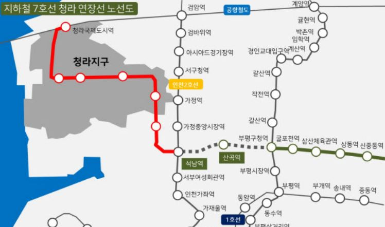
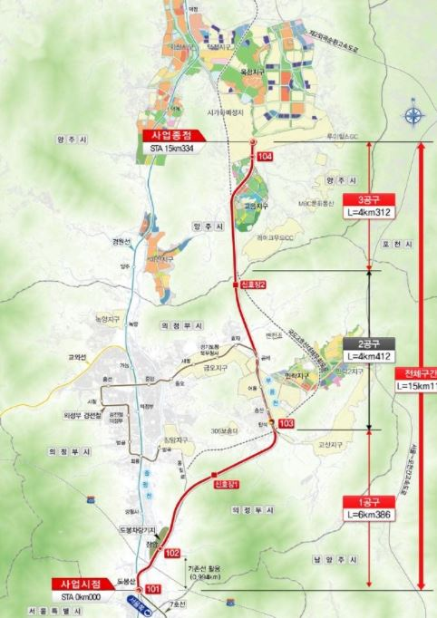
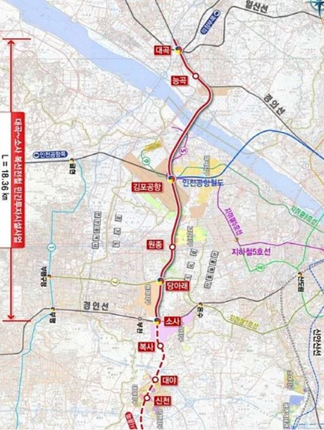
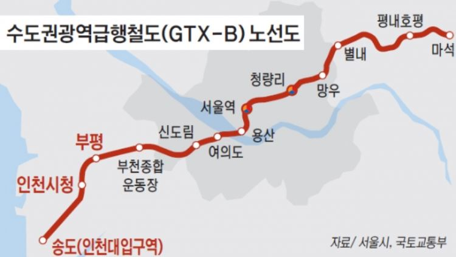
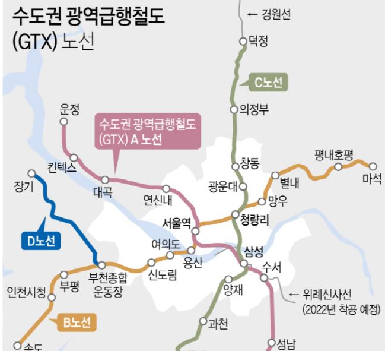
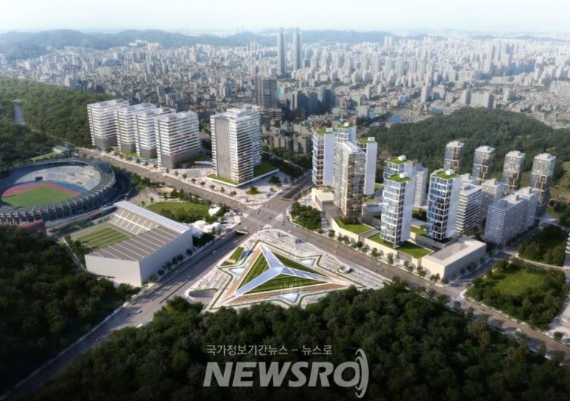
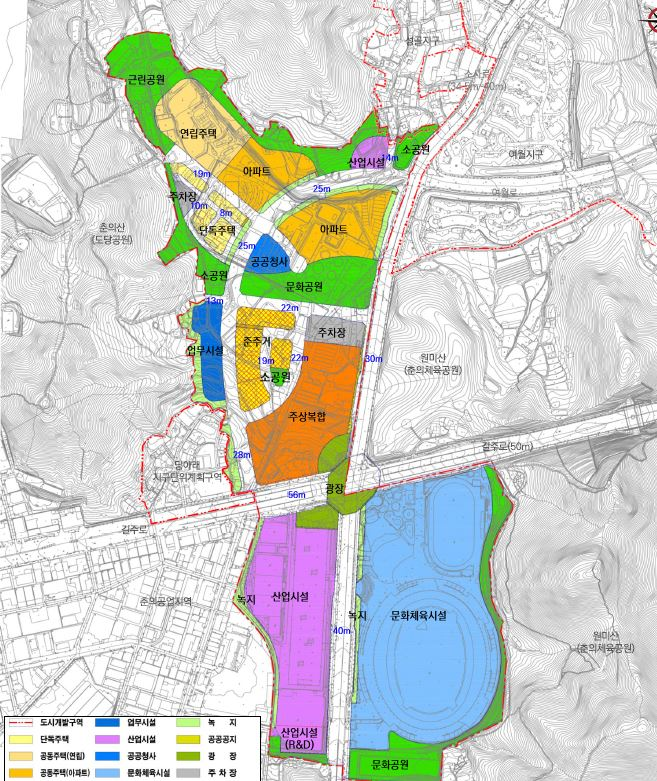
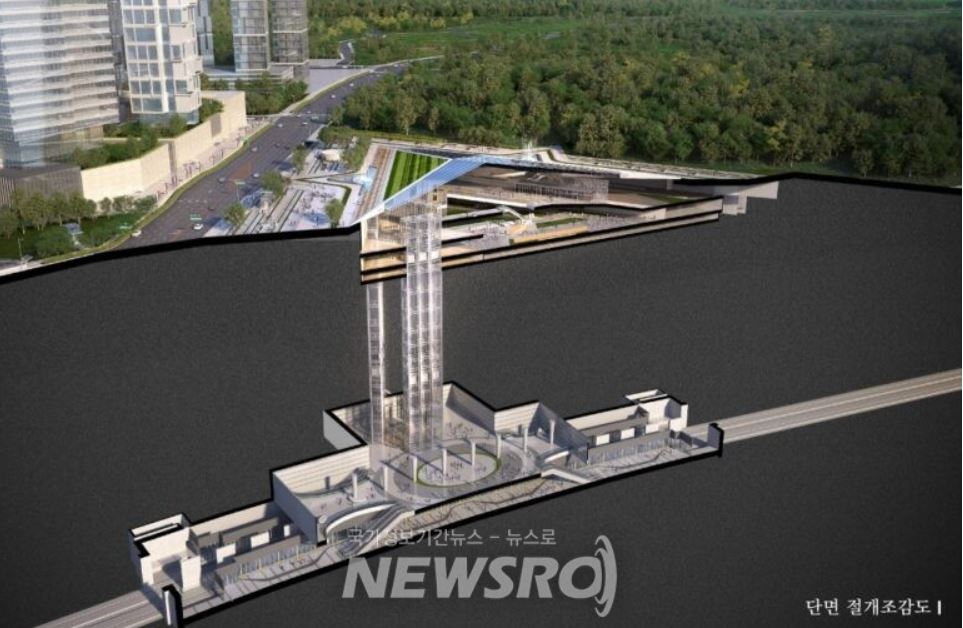

안녕하세요. 데일리리뮤입니다. 부천종합운동장역 개통 노선 및 역세권 개발사업, 복합환승센터에 대해 알아보도록 하겠습니다.

최근 GTX-D 노선이 기존 삼성역을 거쳐 하남까지 이어지게 될 것이라는 예상과 달리 부천까지 노선만 발표되어 많은 논란이 있습니다. 김포, 검단 주민들의 교통기본권을 위해 GTX-D 노선은 하남까지 개통되어야 한다고 생각합니다. 개인적인 의견은 여기까지만 적어두고, GTX-B, D를 포함하여 4개노선 환승역으로 예정된 부천종합운동장역에 대해 알아보도록 하겠습니다.

### 부천종합운동장역 개통(예정)노선

#### 1\. 7호선

현재 부천종합운동장역은 7호선(부평구청역~장암)이 지나고 있습니다. 7호선은 25년까지 양주옥정역, 27년까지 청라국제도시역까지 연장될 계획이 있습니다.

<figure>

<figcaption>

이미지출처 : 땅집고

</figcaption>

</figure>

<figure>

<figcaption>

이미지출처 : 연합뉴스

</figcaption>

</figure>

#### 2\. 대곡~소사선

현재 개통된 부천에서 시흥을 거쳐 안산을 관통하는 소사~원시선과 이어지는 대곡~소사선이 부천종합운동장역을 지날 예정입니다. 대곡~소사선은 기존 21년 7월 개통예정이었으나, 20개월 가량 지체되어 23년 중 개통될 것으로 예상됩니다.

<figure>

<figcaption>

이미지출처 : 고양신문

</figcaption>

</figure>

위 이미지 상 당아래로 표기된 역이 부천종합운동장역이며 김포공항역을 거쳐 GTX-A역에 예정된 일산 대곡역으로 향하는 노선입니다.

#### 3\. GTX-B

다들 많이 알고 계시는 GTX-B노선은 27년 개통예정(해당 시기는 연기될 가능성이 높습니다.)이며, 송도에서 신도림, 여의도, 서울역을 거쳐 남양주 마석까지 이어지는 노선입니다. 부천종합운동장역에서 탑승시 일자리가 많은 여의도까지 8분, 서울역까지 14분 소요될 것으로 예상됩니다.

<figure>

<figcaption>

이미지출처 : 인천인 뉴스

</figcaption>

</figure>

#### 4\. GTX-D

GTX-D노선은 현재 김포 장기역에서 부천종합운동장역까지 확정된 상태입니다. 부천종합운동장역에서 김포 장기역까지 15분 가량 소요될 것으로 예상되며, 추후 삼성역 직결시 삼성역까지 약 15분~20분 소요될 것으로 추정됩니다.

<figure>

<figcaption>

이미지출처 : 연합뉴스

</figcaption>

</figure>

### 종합운동장 역세권 융복합개발

<figure>

<figcaption>

이미지출처 : 뉴스로

</figcaption>

</figure>

부천시 홈페이지에 따르면 종합운동장역 일원은 49만제곱미터의 부지(참고 : 판교 제1테크노밸리 부지는 66만제곱미터입니다.)에 개발비 4100억원이 소요되는 사업으로 R&D센터와 주상복합, 아파트, 도시농업공원으로 개발될 예정입니다. 홈페이지상 21년 11월 공사착수, 24년 준공예정이나 현재 LH사태로 일정이 불투명해보입니다.

<figure>

<figcaption>

이미지출처 : 부천시

</figcaption>

</figure>

### 복합환승센터

복합환승센터는 지상공간에 드러나지 않고 모두 지하화될 계획입니다. 지하1층은 택시 및 버스 환승정류장, 지하 2층은 7호선 및 대곡~소사선 환승통로, 지하3층은 환승주차장으로 사용될 예정이며, GTX-B, D노선은 그 아래 층에 위치하게 될 예정입니다.

<figure>

<figcaption>

이미지출처 : 뉴스로

</figcaption>

</figure>

오늘은 총 4개 노선이 예정된 부천종합운동장역에 대해 알아보았습니다. 교통망을 보았을 때 향후 수도권 서부 교통의 중심이 될 곳으로 여겨집니다. 부천종합운동장역 주변 아파트 단지 등에 지속적으로 관심 가져보시면 좋을 것 같네요. 이상으로 글을 마치겠습니다. 읽어주셔서 감사합니다.

아래 부동산 질문게시판에 부동산 질문 남겨주시면 사소한 것도 최대한 답변드리겠습니다. [부동산 질문게시판](https://www.dailyremu.com/?page_id=461&mod=list)
