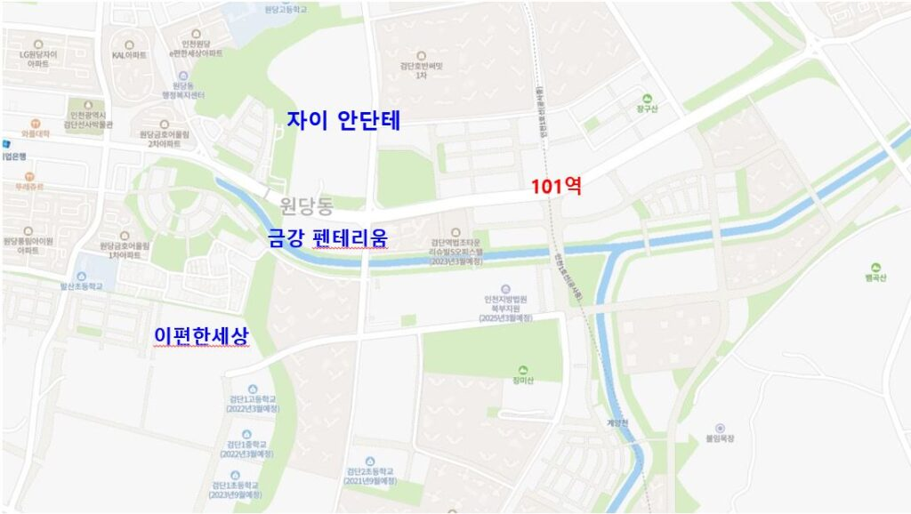
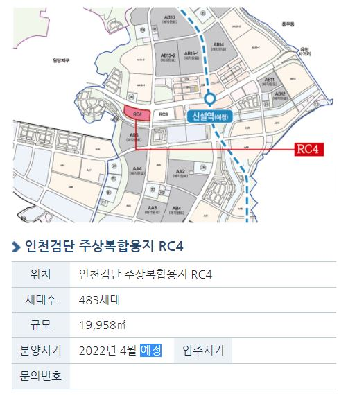
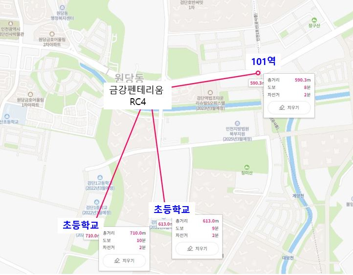
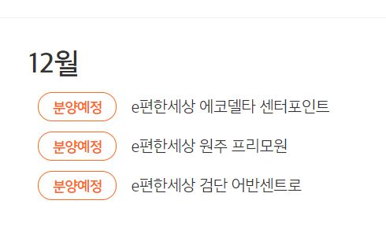
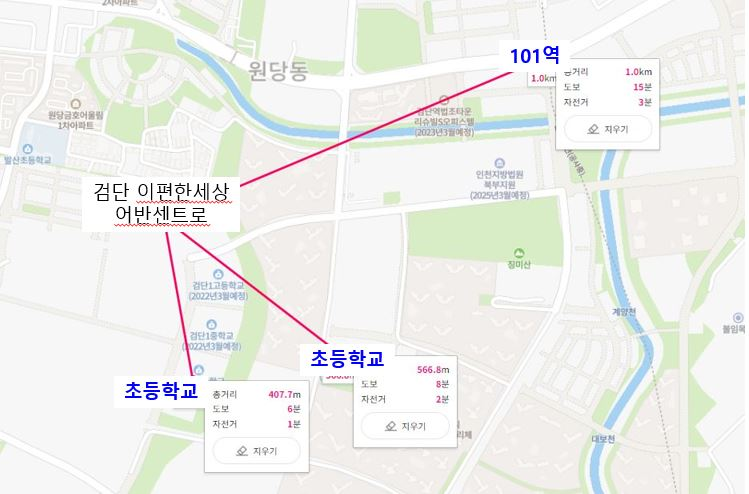
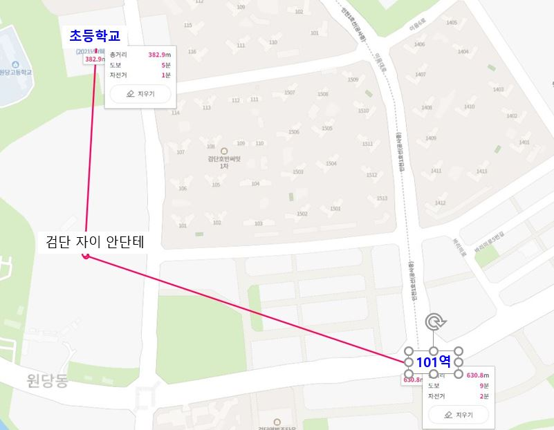
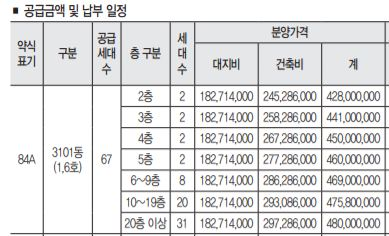
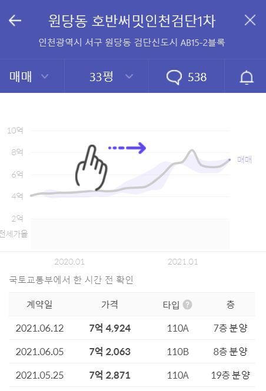

안녕하세요

데일리리뮤입니다.

오늘은 검단신도시 분양예정단지 일정을 정리해보았습니다. 분양일정은 꽤나 자주 연기되니 참고용으로 읽어주시면 감사하겠습니다.

많이들 아시겠지만, 검단신도시에 3개월 내에 분양이 예정되어있는 단지는 총 3개 단지 입니다. 단지별 분양 물량 및 대략적인 개요를 설명드리겠습니다.

1. 검단 금강펜테리움 RC4 (6월 예정?, 연기, 22년 4월)
2. 검단 이편한세상 어반센트로 (9월 예정, 21년 12월)
3. 검단 자이 안단테 (8월~9월 예정)

<figure>

<figcaption>

출처 : 네이버지도

</figcaption>

</figure>

### 검단 금강펜테리움 RC4

먼저, 금강펜테리움입니다. 21년 5월에 분양을 진행한 금강펜테리움 더 시글로(RC3)의 RC4 옆자리에 위치하고 있습니다. 아시는분들은 다들 아시겠지만 금강펜테리움 더 시글로의 청약은 상당히 치열했으며, 일반공급 점수 커트라인은 당해 기준 57점, 기타지역 기준 62점을 기록했습니다.

총 483세대가 민간분양으로 예정되어 있으며, 공식홈페이지 상 6월 예정으로 공지되어 있었으나 아직 소식이 없는 것으로 보아 연기된 것으로 보이네요.

일부 소문으로는 인허가 문제로 지연됬다고 하긴하니 7월에는 공고되지 않을까 조심스럽게 예측해봅니다.

(2021.10.12 기준) 금강펜테리움 공식홈페이지상 분양예정일정이 22년 4월로 수정되었습니다.

<figure>

<figcaption>

이미지 출처 : 금강 펜테리움 공식홈페이지

</figcaption>

</figure>

RC4는 지난 5월 분양한 RC3와 입지적으로는 거의 유사하나 인천지하철 1호선 예정위치와 500m 정도 떨어져있어 도보 5~10분내 거리에 있습니다.

중심상업지구는 역사 주변에 위치하고 있으며, RC3부지와 함께 스트리트몰을 조성한다고 하니, 단지 내부에서도 편리하게 쇼핑, 외식 등을 누릴 수 있을 것으로 보이네요.

<figure>

<figcaption>

이미지 출처 : 네이버지도

</figcaption>

</figure>

다만 자이안단테 예정부지 위쪽에 위치한 한별초등학교, 유승한내들 에듀파크 근처에 위치한 검단1, 2초등학교가 약 600~700m 정도 떨어져 있어 가깝지는 않은 편입니다.

그럼에도 101역과 중심상업지구와 밀접한 점을 볼 때 전반적으로 좋은 입지입니다.

### 검단 이편한세상 어반센트로

검단 이편한세상 어반 센트로는 822세대를 9월 (2021.10.21 기준, 이편한세상 공식 홈페이지상 분양예정일자가 21.12월로 나와있습니다.)민간분양예정입니다.

<figure>

<figcaption>

이미지 출처 : 이편한세상 공식홈페이지

</figcaption>

</figure>

아래 보여드린 지도이미지를 참고하여 보시면 다른 단지에 비해 상대적으로 역과 멀리 떨어진 것을 보실 수 있습니다.

<figure>

<figcaption>

이미지 출처 : 네이버지도

</figcaption>

</figure>

검단 101역과 직선거리로 약 1km이상 떨어져 있어, 도보로 접근은 어려움이 있습니다.

초등학교도 금강 펜테리움 예정부지에 비해 가까우나 약 400~500m 거리로 크게 가깝지는 않습니다.

### 검단 자이 안단테(9월 청약 마감)

검단 자이 안단테는 AA13-1, AA13-2 총 2개 블럭에 각각 702세대, 964세대 가 공공분양으로 공급될 예정입니다.

8월 공급 예정이며, 9월로 연기되었다는 얘기가 있어 정확히 자료 조사 중입니다. 아직 GS건설 홈페이지 등에서는 분양 예정 일정을 찾아볼 수 없습니다.

9월에 청약이 마감되었습니다.

<figure>

<figcaption>

이미지 출처 : 네이버 지도

</figcaption>

</figure>

단지가 워낙 커서 동에 따라 거리 차이가 크지만 101역과의 거리는 400~700입니다. 초등학교와는 길을 건너지 않고 단지와 접하고 있어 초등학교 접근성은 높은 편입니다.

### 예상 분양가 및 시세차익

검단신도시는 공공택지지구로 분양가 상한제가 적용되어 있으며, 최근 분양한 단지와 비교하여 보면 쉽게 예상분양가를 추정해볼 수 있습니다.

최근 분양한 금강 더펜테리움 더 시글로는 평형 타입 및 층수에 따라 다르지만 84A타입 20층 이상 기준, 4억7천만원이었습니다.

<figure>

<figcaption>

이미지출처 : 금강펜테리움 더 시글로 모집공고문

</figcaption>

</figure>

일반적으로 중심상업지구에 위치한 단지의 분양가격이 비싼축에 속하므로,

위에서 다룬 세 단지 중 금강펜테리움 RC4는 위와 유사한 가격(84타입 기준) 에 분양할 것으로 보입니다.

그에 비해 자이 안단테는 공공분양이므로 84타입 기준 4억중반 미만으로 나올 것으로 예상됩니다. 어디까지나 개인적인 의견이니 참고만 해주세요

<figure>

<figcaption>

이미지출처 : 호갱노노

</figcaption>

</figure>

현재 실거래가는 자이 안단테와 인접한 호반써밋을 기준으로 살펴보았습니다. 해당 단지는 21년 6월 전용 85타입이 7.2~7.4억으로 거래되었습니다.

이를 통해 보면 적어도 금강 펜테리움, 자이안단테 당첨시 최소 2억의 시세 차익을 예상해볼 수 있습니다.

물론 전매제한기간이 당첨시점으로부터 5년으로 예상되어, 5년 이후 집값이 크게 변동한다면 차이가 있을 수 있습니다. (5월에 공고된 금강펜테리움 더 시글로 분양단지의 전매 제한 기간은 5년이었습니다.)

> _\*(참고) 분양가가 분양가상한제 지역 주변 시세의 100% 이상인 경우 전매제한기간은 5년, 80% 미만인 경우 전매제한이 10년입니다. 많은 분들이 주변 시세 기준을 호반써밋, 금호어울림 등 전매가 풀린 단지를 기준으로만 생각하시나, 검단구도심 아파트, 빌라 등 또한 시세 산정 기준에 포함됩니다. 따라서 분양가가 주변시세 대비 100%로 산정되어 전매제한이 5년으로 산정되었습니다._

읽어주셔서 감사합니다. 오늘 말씀드린 세 단지 모두 좋은 단지이니 꼭 당첨되시면 좋겠습니다. 좋은 하루 보내세요

아래 부동산 질문게시판에 부동산 질문 남겨주시면 사소한 것도 최대한 답변드리겠습니다. [부동산 질문게시판](https://www.dailyremu.com/?page_id=461&mod=list)
