안녕하세요. 데일리리뮤입니다.

**오늘은 3기 신도시 사전청약(공공분양, 신혼희망타운), 소득기준, 자산기준을 알아보고 간단하게 조회방법도 설명드리도록하겠습니다.**  
(3기 신도시 사전청약 뿐 아니라 공공분양에서도 해당하는 소득기준, 자산기준 확인 방법입니다. 그리고 다들 아시겠지만 공공분양의 소득 및 자산기준은 민간분양의 기준과 다릅니다. 이글은 사전청약 및 공공분양의 기준에 대해 다루고 있습니다.)

소득 및 자산 기준 초과로 부적격시 1년간 재당첨제한이 있으니 꼭 자격을 확인하셔서 청약하시기 바랍니다.

이 글은 공고문 및 사전청약 홈페이지 글을 일부 설명하는 참고글이오니 자세한 내용은 꼭 청약공고문과 3기신도시 사전청약 홈페이지를 정독하시기를 강력히 추천드립니다.

7.28(수)부터 3기신도시 인천계양, 남양주진접, 성남복정, 의왕청계, 위례 사전청약이 진행될 예정이죠. 공고된 지역과 물량에 대한 내용은 독자분들께서 더 잘 아시리라고 생각하고 생략하겠습니다.

### 1\. 소득 및 자산기준

#### 소득 기준

사전청약의 소득기준은 아래 이미지와 같은데요. 일반, 특별공급 유형에 따라 청약가능한 소득기준이 차이(70~140%)가 있으니 각 유형에 맞는 금액을 확인하시기 바랍니다.

추후 예정된 공공분양의 경우 기준이 조금씩 수정되니 청약하실 분양공고문을 통해 해당하는 가구원수에 따른 금액을 확인하시기 바랍니다. (공공분양의 신혼특공과 신혼희망타운은 맞벌이 여부에 따라 소득기준이 달라집니다.)

예를 들어, **아기가 한명이 있는 맞벌이부부**가 공공분양의 신혼부부 특별공급을 넣는다면 아래 표에서 "공공분양/신혼부부/3인이하/배우자소득(유)"에 해당하는 월평균 소득 844만원이하에 해당하여야 청약이 가능합니다. (723만원 이하의 경우 우선공급 가능)

<figure>

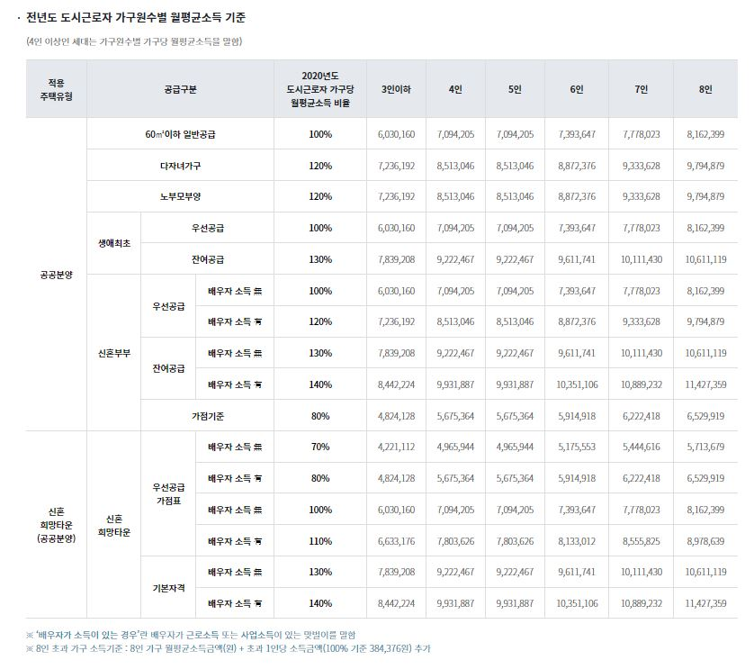

<figcaption>

이미지 출처 : 사전청약.kr

</figcaption>

</figure>

#### 자산기준

자산 기준은 공공분양의 경우, 부동산 2억1550만원 이하, 자동차 3496만원 이하 입니다. 신혼희망타운의 경우, 부동산, 자동차, 금융자산, 기타자산에서 부채를 차감한 금액이 3억700만원을 넘지 않아야합니다.

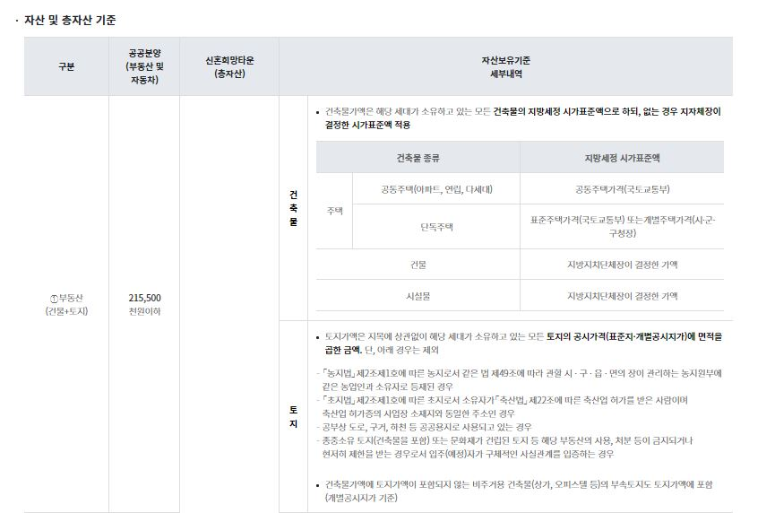

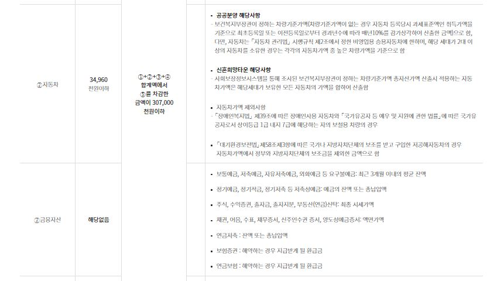

<figure>

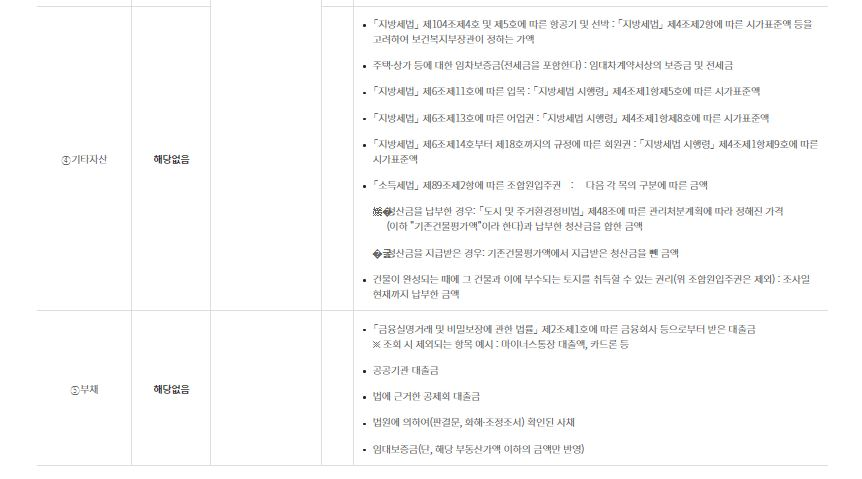

<figcaption>

출처 : 사전청약.kr

</figcaption>

</figure>

### 2\. 내 소득 및 자산 확인 하기

그럼 내가 해당하는 소득기준과 자산기준은 어떻게 확인할까요.

#### 소득기준 확인하기

먼저 소득기준은 근로소득의 경우 국민건강보험공단의 보수월액을 기준으로 하고 가장 우선으로 하고 있습니다. (근로소득 유형, 사업소득, 재산소득에 따라 소득자료 출처가 상이하니 아래 표를 반드시 자세히 읽어보세요)

<figure>

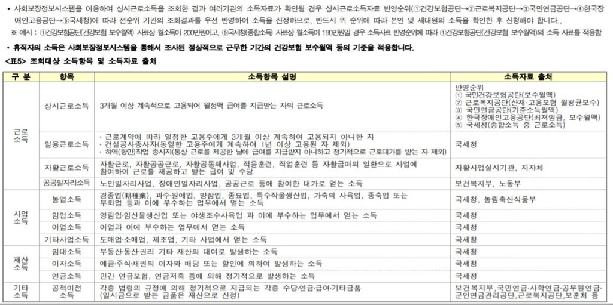

<figcaption>

출처 : 3기신도시 사전청약 모집공고문

</figcaption>

</figure>

직장에 다니시는 분들을 기준으로 국민건강보험공단 보수월액 조회방법을 알아보겠습니다.

건강보험공단의 보수월액은 **건강보험공단 홈페이지->민원요기요->개인민원 -> 보험료조회 -> 직장보험료 조회** 탭에서 확인하실수 있습니다. 아래 이미지 순서대로 파란색 네모로 체크한 버튼을 누르시면 됩니다.  
(공동인증서 로그인 과정도 필요하니 공동인증서를 준비하셔야 해요.)

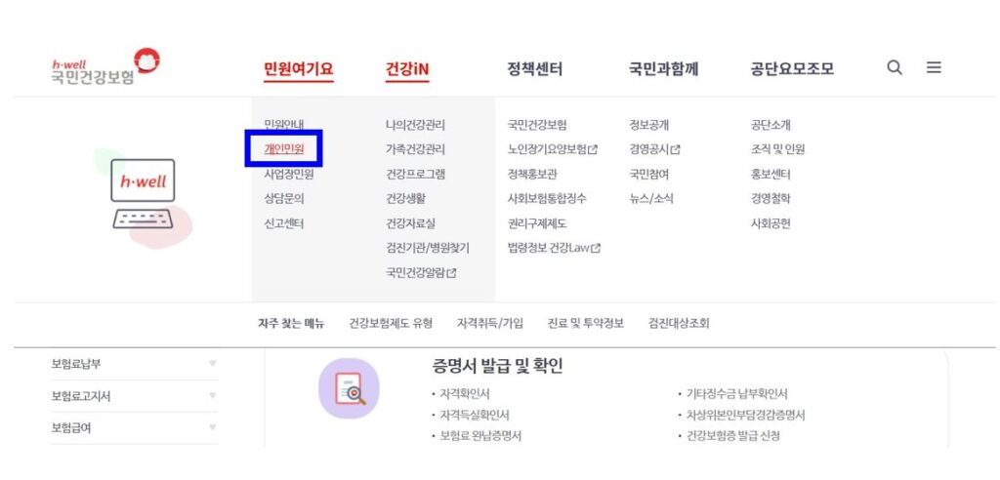

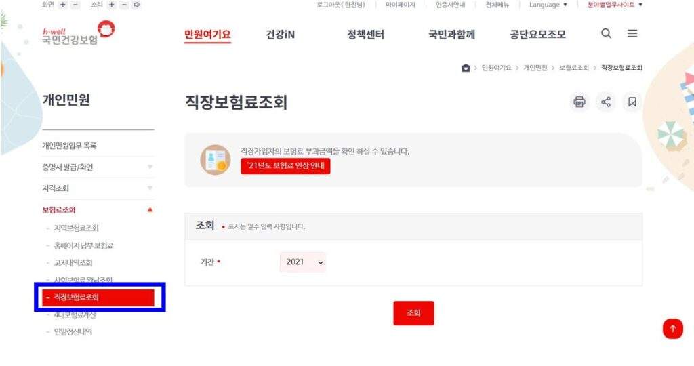

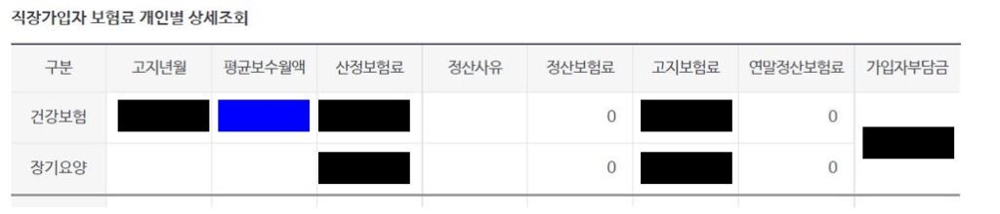

직장보험료 조회까지 누르셨다면 "직장가입자 보험료 개인별 상세조회" 탭을 확인하실 수 있는데요. 위 이미지에서 파란색 네모로 표시한 부분이 청약 소득 산정시 포함되는 금액입니다. 맞벌이이신 경우 남편과 아내 두분 모두의 소득을 확인하시어 합산하셔야 합니다.

#### 자산기준 확인하기

자산기준은 부동산 공시가격과 자동차의 차량기준가액을 확인하시면 됩니다.

<figure>

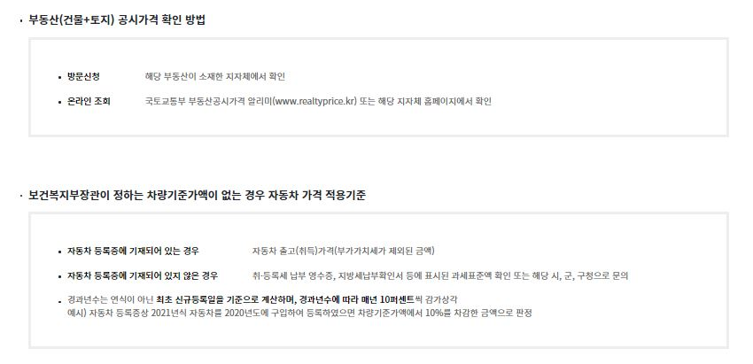

<figcaption>

출처 : 사전청약.kr

</figcaption>

</figure>

부동산 공시가격은 www.realtyprice.co.kr에서 쉽게 확인하실 수 있습니다. 해당 홈페이지에 접속하시어 상단에 공동주택, 표준단독주택, 개별단독주택 공시가격 중 해당하는 탭을 클릭하시어 주소를 기준으로 공시가격 조회가 가능합니다.

<figure>

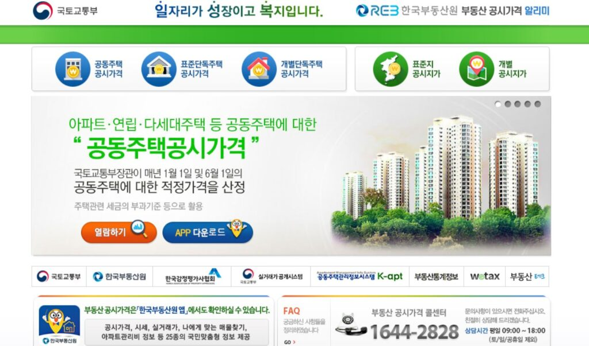

<figcaption>

출처 : 국토교통부 www.realprice.go.kr

</figcaption>

</figure>

차량의 기준가액은 https://www.bokjiro.go.kr/nwel/welfareinfo/carsprcthpuban/selectCarsPrcthPubanPopup.do

위링크에서 확인가능하시며, 조회되는 차량가액은 옵션 등에 따라 일부 상이할 수 있다고 하니 참고용으로 확인하시기 바랍니다.

<figure>

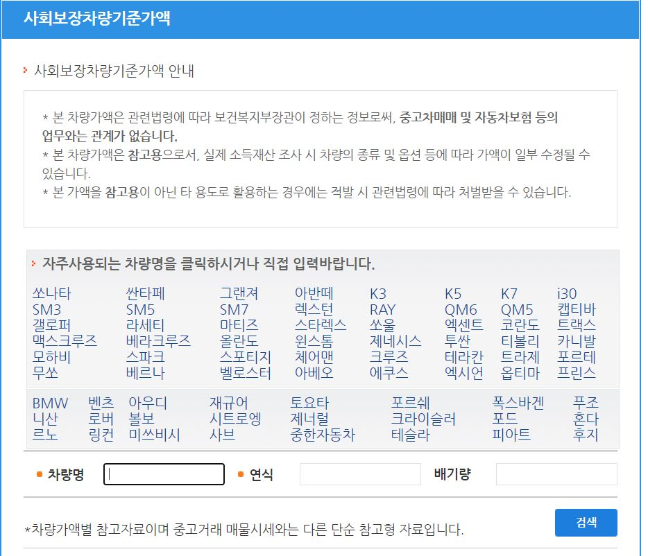

<figcaption>

출처 : 보건복지부 복지로 www.bokjiro.go.kr

</figcaption>

</figure>

이상으로 오늘 글을 마치겠습니다. 소득 및 자산기준을 잘 참고하시어 청약 가능한 공급유형에 전략적으로 청약하시길 바랍니다.

읽어주셔서 감사합니다.

아래 부동산 질문게시판에 부동산 질문 남겨주시면 사소한 것도 최대한 답변드리겠습니다. [부동산 질문게시판](https://www.dailyremu.com/?page_id=461&mod=list)
