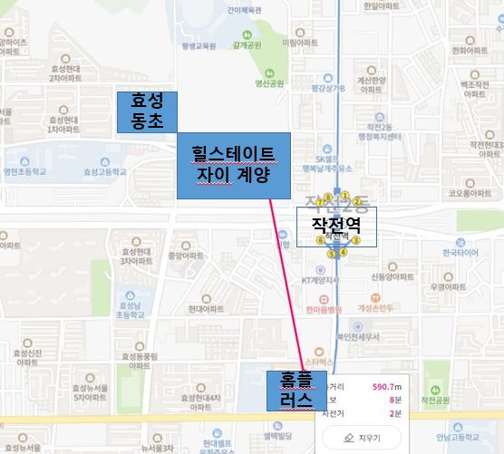
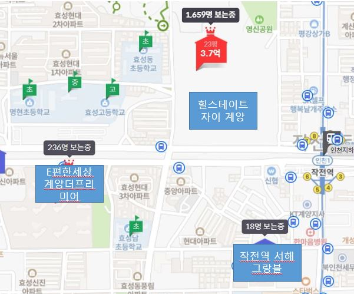
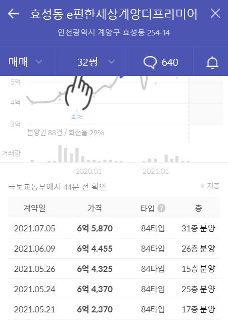
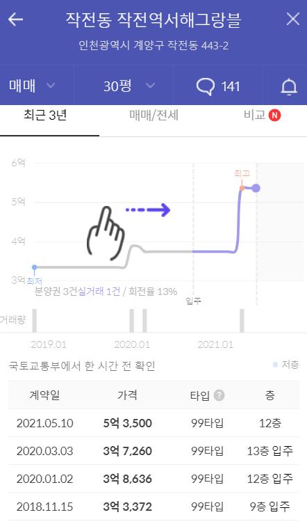
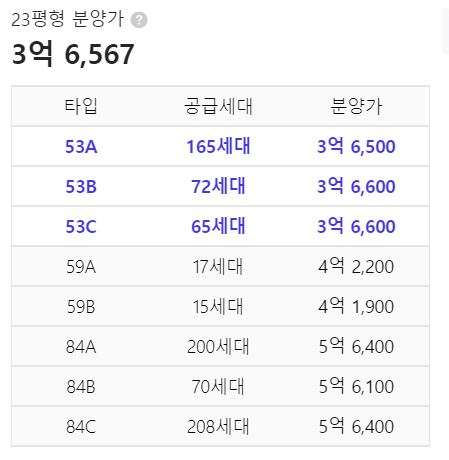
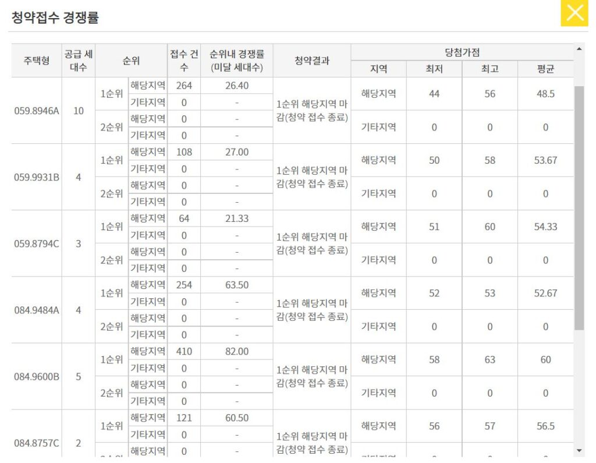

안녕하세요. 데일리리뮤입니다.

오늘은 8.2(월)부터 공급예정인 힐스테이트 계양 자이의 입지 및 인근 단지의 당첨 커트라인에 대해 알아보도록 하겠습니다.

#### 분양 물량 및 입지

힐스테이트 자이는 총 2,371세대의 대단지로 조합원 물량을 제외하고 812세대가 분양 예정입니다. 53A~B 타입은 183세대, 59A~B 15세대, 84A~C 210세대입니다.

<figure>

<figcaption>

출처 : 네이버지도

</figcaption>

</figure>

단지 인근 효성동초등학교는 단지 길건너에 자리하고 있습니다. 작전역은 도보 2분이내에 근접하고 있어 초역세권으로 볼 수 있습니다. 홈플러스도 500~700m 거리에 자리하고 있어 도보 10분이내에 자리하고 있네요.

#### 인근 시세 및 당첨 가점

비교해볼만한 주변단지는 2021년 10월 입주예정인 e편한세상 계양더프리미어(1,646세대)와 2020년 10월 입주한 작전역 서해그랑블(280세대)가 있습니다.

<figure>

<figcaption>

이미지출처 : 호갱노노

</figcaption>

</figure>

대단지이며, 입주시기도 가장 최근인(21년 10월예정) e편한세상 계양더프리미어의 32평(84타입) 실거래가는 6억 2천~6억 5천선입니다. 거래도 최근 5월~7월로 현재 시세를 알아볼 수 있습니다.

<figure>

<figcaption>

이미지출처 : 호갱노노

</figcaption>

</figure>

세대수가 상대적으로 적은 서해그랑블 단지의 21년 실거래가는 1건뿐이었습니다. 평형도 상대적으로 작은 30평 매물이었는데요. 5억 3500만원에 21년 5월에 거래되었습니다.

<figure>

<figcaption>

이미지출처 : 호갱노노

</figcaption>

</figure>

이번에 분양하는 힐스테이트 계양 자이의 분양가는 고층 기준 5억6천만원으로 e편한세상계양더프리미어의 현시세 대비 8천만원~1억정도 시세차익이 예상됩니다.

<figure>

<figcaption>

이미지 출처 : 호갱노노

</figcaption>

</figure>

#### (21년 4월)계양하늘채파크포레 청약결과

지난 21년 4월 계양 하늘채 파크포레는 59타입 436세대, 84타입 785세대 청약이 진행되었습니다. 84타입은 경쟁률은 60.5대 1이상으로 타입별로 52점~46점으로 당첨가점이 형성되었습니다.

<figure>

<figcaption>

이미지출처 : 청약홈

</figcaption>

</figure>

이번 청약에서는 59타입이 거의 없고 53타입과 84타입이 주를 이루고 있습니다. 상대적으로 84타입의 가점이 높게 형성될 것으로 예상되니 참고하시기 바랍니다.

읽어주셔서 감사합니다. 좋은하루되세요.

아래 부동산 질문게시판에 부동산 질문 남겨주시면 사소한 것도 최대한 답변드리겠습니다. [부동산 질문게시판](https://www.dailyremu.com/?page_id=461&mod=list)
