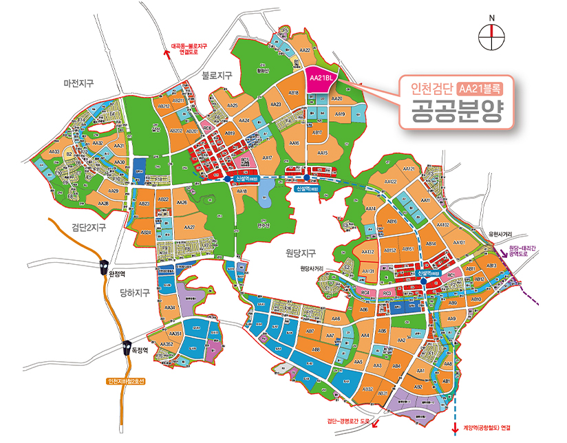
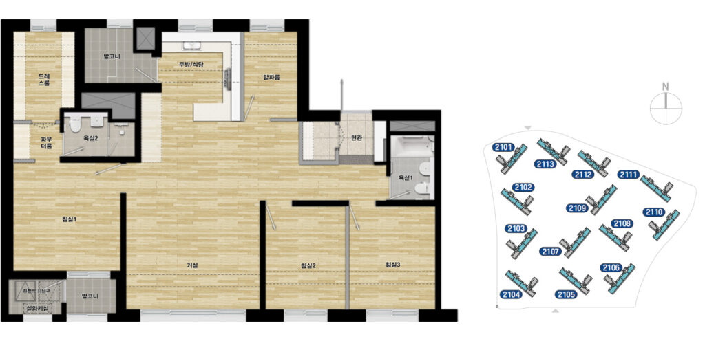
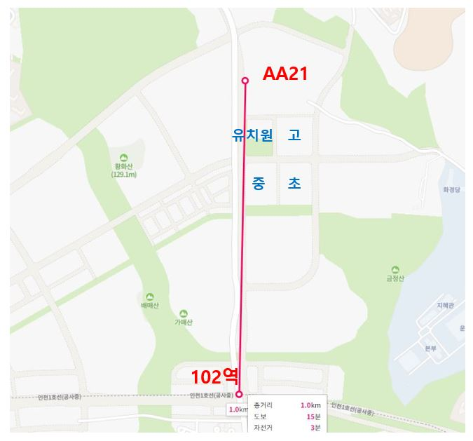
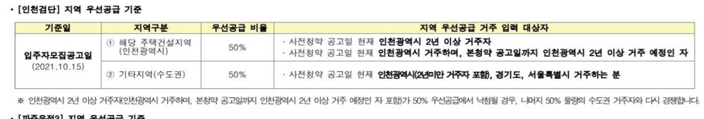

안녕하세요.

데일리리뮤입니다. 10월 15일 오늘 아침 검단신도시 2단계에 위치한 AA21블록의 사전청약 공고가 올라왔습니다.

사전청약 기간은 (당해) 10.25(월) 10:00~10.29(금) 17:00, (기타) 11.01(월) 10:00~11.05(금) 17:00입니다.

개략적인 내용은 아래 글에서 설명하겠지만, 청약을 준비하시는 분은 사전청약.kr 홈페이지에 올라와있는 모집공고문을 꼭 한줄 한줄 읽어보시기 바랍니다.

<figure>

<figcaption>

출처 : 사전청약.kr

</figcaption>

</figure>

## 1\. 공급 개요 및 추정분양가

AA21단지는 LH의 자체 브랜드인 안단테로 22년 8월 본 청약 예정입니다. 총 1,161세대이며 74타입 419세대, 84타입 742세대로 다른 공공분양 사전청약 단지에 비해 많이들 선호하시는 타입으로 나왔습니다.

일반공급 179세대(74타입 : 66세대, 84타입 : 113세대),  
다자녀 115세대(74타입 : 41세대, 84타입 : 74세대),  
신혼부부 347세대(74타입 : 125세대, 84타입 22세대),  
생애최초 289세대(74타입 : 104세대, 84타입 : 185세대) 등입니다.

추정분양가는 사전청약 공고문를 따르면,  
74타입 기준 약 3억7천, 84타입 기준 약 4.2억입니다.  
이 분양가는 추후 변동가능한 금액으로 공고문상에 명시되어 있으니 수준만 참고하시면 좋겠습니다.(당첨되는 층별로 분양가가 다르기도 할것이고요.)

74타입, 84타입 평면도도 공지되었네요. 아래 이미지는 84타입 평면도입니다.

<figure>

<figcaption>

출처: 사전청약.kr

</figcaption>

</figure>

## 2\. 입지 분석

<figure>

<figcaption>

출처 : 네이버지도

</figcaption>

</figure>

위 그림과 함께 봐주시면, 102역과는 도보 1km(네이버 지도 기준 15분)으로 운동으로 걸을만한 거리입니다.

중심상업지구 또한 역 주변에 위치하고 있어 조금 거리가 있습니다.

초등학교 및 유치원은 가까이에 있습니다. 유치원은 작은 도로 건너에 약 2분거리 위치에 있고 초등학교는 그아래에 대로 건너(단지로부터 약 5분거리)에 있습니다.

## 3\. 지원자격 등

많이들 아시다시피 공공분양 사전청약은 공공분양의 기준을 따릅니다.

대략 말씀드리자면 특별공급과 60제곱미터 평형의 경우 소득기준과 자산기준이 있고, 일반공급은 소득 및 자산기준이 없습니다. 소득기준은 전년도 도시근로자 월평균소득의 100~140%로 지원하시는 공급유형별로 상이합니다. 자산기준은 부동산 약 2.15억, 자동차 약 3.5천만원이며, 세부기준이 매우 상세하고 개인별로 확인이 필요한 사항이 많으니 꼭!! 모집공고문을 확인하시고 개별적으로 기준에 해당하시는지 확인해주세요.(아래 링크해드릴 모집공고문 8~9페이지에 있습니다.)

공공분양 청약 자격과 한가지 다르다면 "사전"청약이다보니 당해조건이 차이가 있습니다. 일반적인 당해조건은 "모집공고일 기준 인천시 2년이상 거주"이지만, 사전청약에서는 현재 인천 거주중이며 본청약 공고일까지 2년 거주 예정인자도 당해에 포함합니다.

<figure>

<figcaption>

출처: 사전청약.kr

</figcaption>

</figure>

읽어주셔서 감사합니다.

사전청약 공고문은 아래 위치에 있습니다.  
사전청약.kr 홈페이지 -> 공급정보 -> 사전청약 모집공고 -> 2021년 사전청약 2차지구 공공분양주택 입주자모집공고
