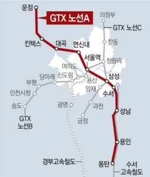
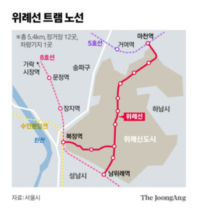
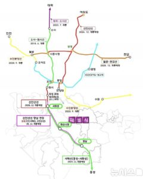
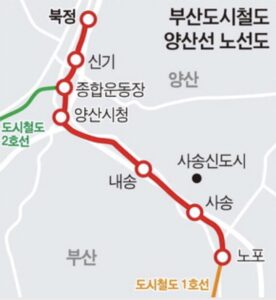

2026년 상반기, 수도권과 지방에서 새로운 지하철·철도 노선이 속속 개통을 앞두고 있습니다. **교통 인프라 확장은 그 지역 부동산 가격에 실질적인 변화를 입히는 요인**으로, 많은 이들의 관심이 집중되고 있습니다.

이번 글에서는 내년 개통 예정인 핵심 철도망과 그 영향력을 세 가지 주요 관점에서 분석합니다.

## 1\. GTX-A ‘완전체’ 개통과 주요 역세권의 집값 부각

가장 눈길을 끄는 변화는 **GTX-A노선의 서울역~수서역 구간 본격 개통**입니다. 지금까지는 동탄역~수서역, 운정중앙역~서울역 등 일부만 개통되어 있었으나, 내년 6월 이들 구간이 완전히 연결됩니다. 기존 ‘허리가 끊긴’ GTX-A가 실질적인 수도권 교통의 대동맥으로 진화하게 되는 것입니다.

국토연구원이 발표한 **GTX-A노선 발표 및 개통 영향 분석**에 따르면, GTX-A역세권 주요 지역의 아파트 가격 상승률은 이미 뚜렷합니다. 동탄역 29.2%, 구성역 26.9%, 수서역 11.9% 등 **GTX-A 개발 기대감만으로도 집값 상승률이 인근 대비 월등히 높았음**이 데이터로 확인됩니다.

이번의 본격 개통 시, **특히 운정, 동탄, 연신내, 대곡** 등 단절된 구간 인근의 생활권이 하나로 이어지며 교통 편의성이 극대화됩니다. 그 중 **수서역 일대는 GTX, KTX, 수서광주선이라는 트리플 교통호재**로, 서울역에 준하는 교통 허브로의 부상이 예상됩니다. 주변 신축단지나 역세권 구축단지의 거래 관심도는 더욱 높아질 전망입니다.

GTX-A의 전 구간 개통은 교통 소외 지역의 실거주자 편익은 물론 주택 수요와 집값에도 직접적인 영향이 불가피합니다. 특히 서울 강남접근성이 극적으로 짧아지는 동탄, 운정, 수서역 일대의 **장래가치가 다시 한번 조명**될 가능성이 큽니다.

## 2\. 위례선 트램, 교통 사각지대의 실질 효익 증가

위례신도시는 신도시 중에서도 유일하게 교통 인프라가 오랫동안 지연되며 집값 상승에 한계가 뚜렷했던 지역입니다. 내년 하반기 예정된 **위례선 트램 개통**은 수혜 지역의 판도를 바꿀 수 있는 변수입니다.

이번에 개통 예정인 트램은 **지하철 5호선 마천역과 8호선·수인분당선 복정역, 남위례역을 잇는 노선**으로, 버스 의존도가 높은 위례에 명실상부한 철도 대안을 제공하게 됩니다. 특히 송파구, 성남 복정동 일대의 **역세권 단지에 실질적 교통 혁신**이 본격화됩니다.

지나치게 오랜 시간 우려만 쌓였던 위례 지역이 본선 트램으로 인구 유입과 상권 성장, 생활 만족도 개선에 직접적인 기대효과를 얻을 전망입니다. **다만, 위례~신사선(경전철) 사업이 17년째 표류 중인 것은 공급측 정책 실패의 한 단면으로 지적**할 만합니다.

위례트램 주변 신규·구축 아파트, 상가, 토지의 가치는 향후 **실거주 편의성 개선폭에 따라 달라질 수 있음**에 주목해야 합니다.

## 3\. 서해선·양산선 지방 노선, 광역권 집값 파급력 실험대

내년 철도 개통은 수도권에만 그치지 않습니다. 서화성~원시를 잇는 **서해선 신설 구간**은 그동안 교통여건이 불리했던 수도권 서남권 및 충남권의 대중교통 환경을 현격히 개선시킵니다.

특히 서해선 연장과 **경부선 KTX, 신**

**안산선 등과의 연계로 교통망 시너지가 극대화**됩니다. 일산·파주(운정)까지 연장되는 추가 사업 추진으로 대곡, 일산 거주자는 환승 없이 안산, 고양, 부천, 충남 서해안까지 갈 수 있게 됩니다. 이런 변화는 **광역 철도망의 완성도가 지방 내 경쟁력을 좌우한다는 점**을 다시금 부각합니다.

 

지방권역에서는 **양산도시철도(양산선) 개통**이 주제입니다. 부산도시철도 1·2호선을 연결하면서, 부산 및 경남 양산·사송신도시권의 출퇴근·등하교 시간이 절감되고 이동 패턴 변화도 예상됩니다. 단순한 교통 인프라 확장일 뿐 아니라, **대중교통 접근성에 따른 부동산 가치 재평가 계기**가 될 것입니다.

수도권 외곽 또는 지방권 부동산의 입지 프리미엄은 광역 교통망에 직접적으로 좌우될 수 있습니다. 새 철도 노선 연계 지역은 **기존 교통 한계로 저평가됐던 영역까지 시장 관심을 빠르게 확장시킬 가능성**이 있습니다.

## 최종 정리

**2026년은 수도권과 지방의 여러 신설 철도와 노선이 실질적으로 부동산 가치를 뒤흔드는 한 해가 될 것**입니다. GTX-A의 전면 개통(삼성역 제외), 위례선 트램과 서해선 등 신규 교통 인프라는 그 자체로 해당 지역의 실거주 매력과 입지 변수를 크게 상승시키는 요인입니다.

 

출처: [GTX 신설·확장과 집값 상승 변수 분석 / 매일경제](https://www.mk.co.kr/news/realestate/11588889)
