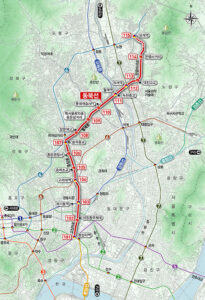
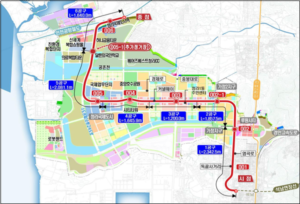

수도권을 관통하는 대표적 신(新)철도 사업인 서울 동북선 경전철과 7호선 청라 연장선의 개통 시기가 2027년 이후로 미뤄졌다는 소식이 전해지고 있습니다. 수도권 교통 지형도와 부동산 시장 모두에 직접적인 영향을 미칠 이번 개통 지연, 핵심 쟁점은 무엇이고 앞으로 무엇이 달라질지 살펴봅니다.

## 주요 신(新)철도 사업, 대거 2027년 이후로 미뤄져

**처음 2025년 개통을 예고했던 수도권 지하철·전철 노선 상당수가 2027년 이후로 완공 목표를 변경했습니다.**

 동북선 경전철은 상계에서 왕십리까지 13.4km를 잇는 노선으로 16개 신규 역, 7개의 환승역 및 8개의 환승 노선을 제공합니다. 최근 발표에 따르면 완공 목표는 2027년 11월로 조정됐으며, 서울 노원과 성북 지역 주민들의 기대 역시 길어진 개통 시점만큼 미뤄졌습니다.

또 다른 대형 사업인 서울 7호선 청라 연장선 역시 2027년 개통이 목표입니다. 현재 7호선 종점인 석남역에서 공항철도 청라국제도시역까지 8개 역이 새로 들어서는 10.7km 구간입니다. 완공 시, 청라국제도시에서 강남 논현역 등 서울 주요 지역까지 한 번에 이동할 수 있게 되어, 이동 소요시간이 크게 줄어들 것으로 보입니다.

**이처럼 수도권 광역 교통망의 핵심인 두 사업 모두 2027년으로 일정이 밀리면서, 지난 몇 년간 여러 지역에서 확인됐던 교통 호재의 실현 가능성 자체에 대한 신뢰도 재점검이 필요해졌습니다.** 구체적으로, 철도 개통에 기대어 역세권 프리미엄 부상 및 거래가격 상승을 노리는 흐름에는 장기전이 예고된 셈입니다.

## 교통 인프라 계획과 부동산 가치, 상관관계의 최근 경과

- 최근 수도권 내 신규 철도·지하철 노선이 실질적으로 부동산 시장에 미친 영향을 볼 수 있는 대표 사례 중 하나가 GTX 노선입니다. GTX 개통 수혜 기대 지역에서 아파트 가격이 경기도 평균 대비 높은 상승폭을 기록했습니다. 실제로 역세권 새 단지의 신고가 거래가 잇따랐고, 5호선 하남 연장으로 인접 아파트 매매가격이 단기에 크게 뛰기도 했습니다.
- 그 밖에도 진접선, 신분당선, 대곡소사선 등 연속된 신규 노선 개통 때마다 주변 주택 가격이 민감하게 반응했습니다. 특히 환승역이 늘고 서울 도심 접근성이 향상된 구간 인근 부동산 시장이 받는 영향은 꾸준히 검증되어왔습니다.
- 하지만 이번 동북선·7호선 청라 연장선과 같이 대형 사업의 개통이 미루어질 경우, 시장 참가자와 실거주자 모두 실제 교통망 확충까지 걸리는 시간을 재평가할 필요가 생겼습니다. **기획 단계 또는 착공 단계에서의 기대감 상승과 실개통이 늦어짐에 따라 가격이 조정되거나, 단기 불확실성에 시장 심리가 위축되는 경우도 나타납니다.**

긍정적인 흐름을 가정할 경우, 예정대로 2027년 완공 시 노원·성북 일대 및 청라국제도시는 직접적인 교통 혁신과 생활권 개선을 경험할 수 있게 됩니다. 교통 확장에서 파생될 신규 수요와 역세권 개편은 장기적인 지역 가치 상승을 뒷받침할 수 있습니다.

우리에게 중요한 기초는 확정적 개통 시점이 아니라, '사업 진행의 신뢰성'과 '실제 교통 인프라 변화가 현실화되는 과정의 흐름'을 꾸준히 관찰하는 것입니다. 단기 이슈(지연)만 지나치게 걱정하지 않으면서도, 결코 근거 없는 장밋빛 전망만 좇아서는 안 되는 시점입니다.

 

궁극적으로, 수도권 교통 인프라 개선의 효과는 장기적으로 지역 가치와 거주 편의, 경제 활성화에 긍정적이나, 실제 변화는 개통 이후에 본격화될 수밖에 없습니다. 현재 변동성 구간에선, 교통망 확충의 기대감과 일정 지연의 리스크 모두를 균형감 있게 바라볼 필요가 있습니다.

출처_:_ 서울 동북선_·7_호선 청라연장 등 주요 신_(_新_)_철도 교통호재 _/_ 매일경제 _/_ [원문링크](https://www.mk.co.kr/news/realestate/11588890)
